= {toc-title}
:author: JouZiton
:doctype: book
:encoding: UTF-8
:lang: zh-CN
:numbered: 编号
:stem: latexmath
:icons: font
:source-highlighter: coderay
:sectnums:
:sectlinks:
:sectnumlevels: 4
:toc: left
:toc-title: Jenkins
:toclevels: 4

[perfer]
== 前言

如果截图于展示的内容不同, 大概率是安装插的差异, 请自行查找自己对应的配置参数.

== 简介

=== DevOps

`DevOps` 是 `Development`（开发）和 `Operations`（运维）的组合词，是一组过程、方法与系统的统称，用于促进开发（应用程序/软件工程）、技术运营和质量保障（QA）部门之间的沟通、协作与整合。

=== Jenkins

`Jenkins` 是一个开源软件项目，旨在提供一个开放易用的软件平台，使软件的持续集成变成可能。`Jenkins` 是用 `Java` 编写的，可在 `Tomcat` 等流行的 `servlet` 容器中运行，也可以作为独立的 `daemon` 运行。

=== 持续集成

`持续集成` 是一种软件开发实践，即团队开发成员经常集成他们的工作，通常每个成员每天至少集成一次，也就意味着每天可能会发生多次集成。每次集成都通过自动化的构建（包括编译，发布，自动化测试）来验证，从而尽早地发现集成错误。许多团队发现这种方法可以显著减少集成问题，并允许团队更快地开发软件。这种做法的核心是持续集成服务器，它是一个服务器，可以持续集成代码，通常是每天构建一次，也可以是每小时构建一次。

=== 持续交付

`持续交付` 是一种软件工程方法，旨在通过建立可靠的软件发布流程，将软件的生产频率提高到任何时候都可以发布的水平。持续交付的目标是建立一个可重复、可靠的软件发布流程。它需要一个持续集成的基础，以自动化软件的构建、测试和准备。持续交付的最终目标是使软件的发布过程更加频繁，从而可以在任何时候发布软件。

== 安装

=== ``Docker``安装``Jenkins``

官网参考: https://hub.docker.com/r/jenkins/jenkins

注意: 我本地是使用的``jdk 17``, 所以这里使用的是``jenkins/jenkins:lts-jdk17``镜像

[source, shell]
----
# 拉取 Jenkins 镜像（最新的）
docker pull jenkins/jenkins:lts
# 启动 Jenkins
docker run \
--name jenkins \
--privileged=true \
--restart=on-failure \
-itd \
-p 8080:8080 \
-p 50000:50000 \
-e JENKINS_OPTS='--prefix=/jenkins' \
-e TZ='Asia/Shanghai' \
-e JENKINS_ARGS='--prefix=/jenkins' \
-e JAVA_OPTS="-Dhudson.security.csrf.GlobalCrumbIssuerConfiguration.DISABLE_CSRF_PROTECTION=true" \
jenkins/jenkins:lts-jdk17

# Jenkins (2.319.3) 或更高版本

# 查看 Jenkins 密钥 303a13d7f2384555b8e32910b20c5358
docker exec -it jenkins cat /var/jenkins_home/secrets/initialAdminPassword

----

=== ``yum``安装``Jenkins``

--nogpgcheck

[source, shell]
----
# 清除缓存
sudo yum clean all
# 安装 Jenkins 公钥
sudo rpm --import https://pkg.jenkins.io/redhat-stable/jenkins.io.key
# 安装 Jenkins, ``--nogpgcheck``参数, 表示忽略公钥检查
sudo yum install jenkins -y --nogpgcheck
# 设置开机启动
sudo systemctl enable jenkins
# 启动 Jenkins
sudo systemctl start jenkins
# 获取初始化密码
sudo cat /var/lib/jenkins/secrets/initialAdminPassword
----

[NOTE]
====
``--nogpgcheck``参数, 表示忽略公钥检查
====

=== 插件

.插件安装镜像
. 默认: https://updates.jenkins.io/update-center.json
. 清华: https://mirrors.tuna.tsinghua.edu.cn/jenkins/updates/update-center.json

.常用插件
. `Git`（如果使用的gitee, 也可用这个插件）
.. `Git Parameter`: 用于选择分支
. `Maven
. `Chinese` （非必须）
. `Over SSH`(需要部署到服务器, 这个参数是必须的)

[TIP]
====
安装完插件之后记得重启服务
====

=== 安装Maven

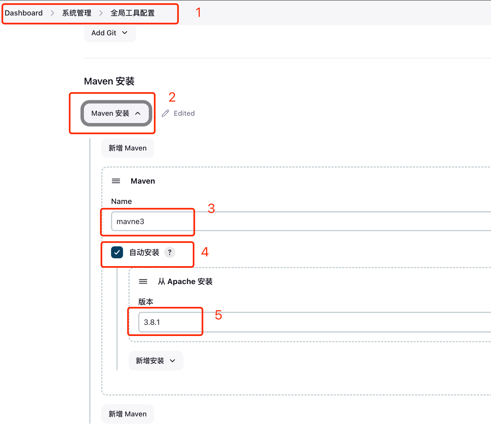

. 进入``Dashboard 控制面板``-> ``系统管理``->``全局工具配置``
. 找到``Maven``配置项
. 输入``Maven name``(这个名称自己能看懂就行)
. 点击``Maven``配置项的``自动安装``按钮
. 选择``安装版本``，这里选择``3.8.1``版本(根据自己的项目选择maven版本)
. 点击``apply 应用``按钮

'''

如果没有安装``Maven``, 在``Maven``项目构建的时候, 会报``maven``找不到

[TODO] 缺一张截图

== 入门

=== 第一个Jenkins项目(``gitee``项目)

.操作步骤
. 新建一个``springboot demo``项目, 并上传到``gitee``上（这个步骤参考``gitee``的操作）
. 在``Jenkins``中创建一个项目
. 修改``Job``的配置
. 构建项目
. 查看构建结果

==== 创建一个``springboot demo``项目

. 项目地址(仅供参考): https://gitee.com/jouzitong/springboot-demo

==== 在``Jenkins``中创建一个项目

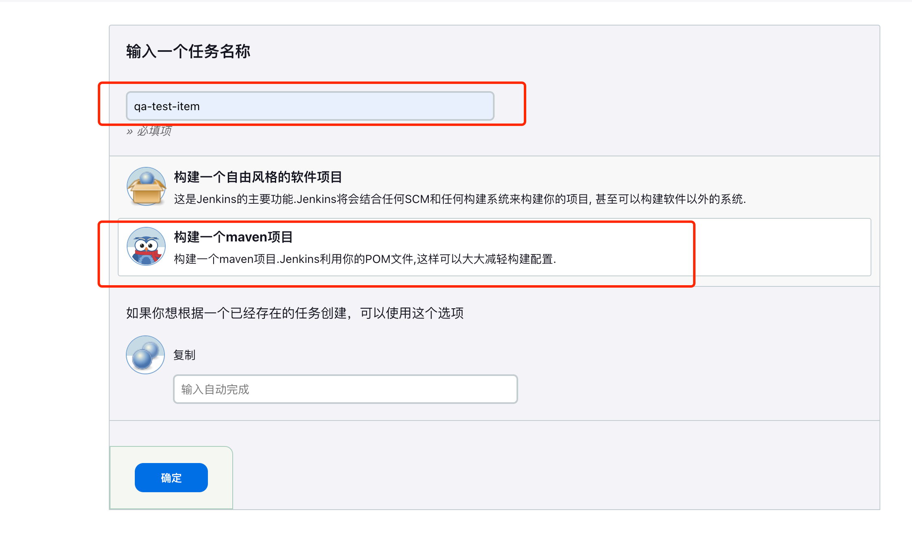

* 任务名称: 填写自己的项目名称即可, 不必填写代码仓库名称, 关键是要和其他项目的的仓库去分开就行
* 项目类型:
** 自由风格的软件项目: 一般用于构建项目
** Maven 项目: 一般用于构建``maven``项目（我选择这个）

==== 修改``Job``的配置

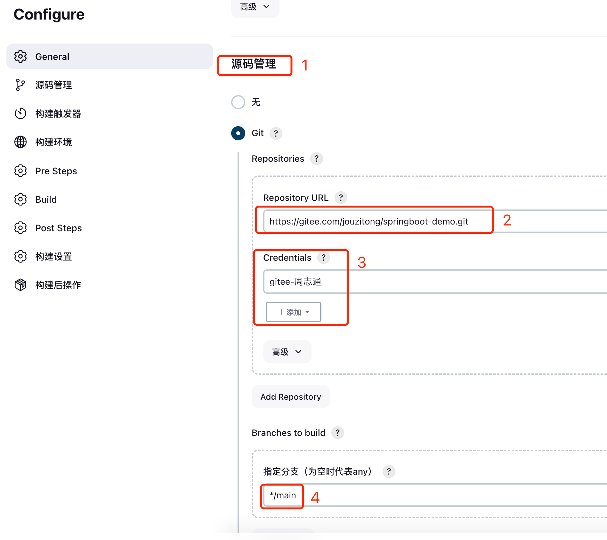

. 源码管理: 无和``git``, 这里选择``git``管理
. 仓库地址: 填写自己的仓库地址
. 认证凭据: 这个有多种认证方式. 这里选择``用户名和密码``，并填写自己的``gitee``账号密码
. 分支: 默认分支, ``*/master``, 但是我的项目主分支是``main``, 所以填写了``*/main``

==== 构建项目

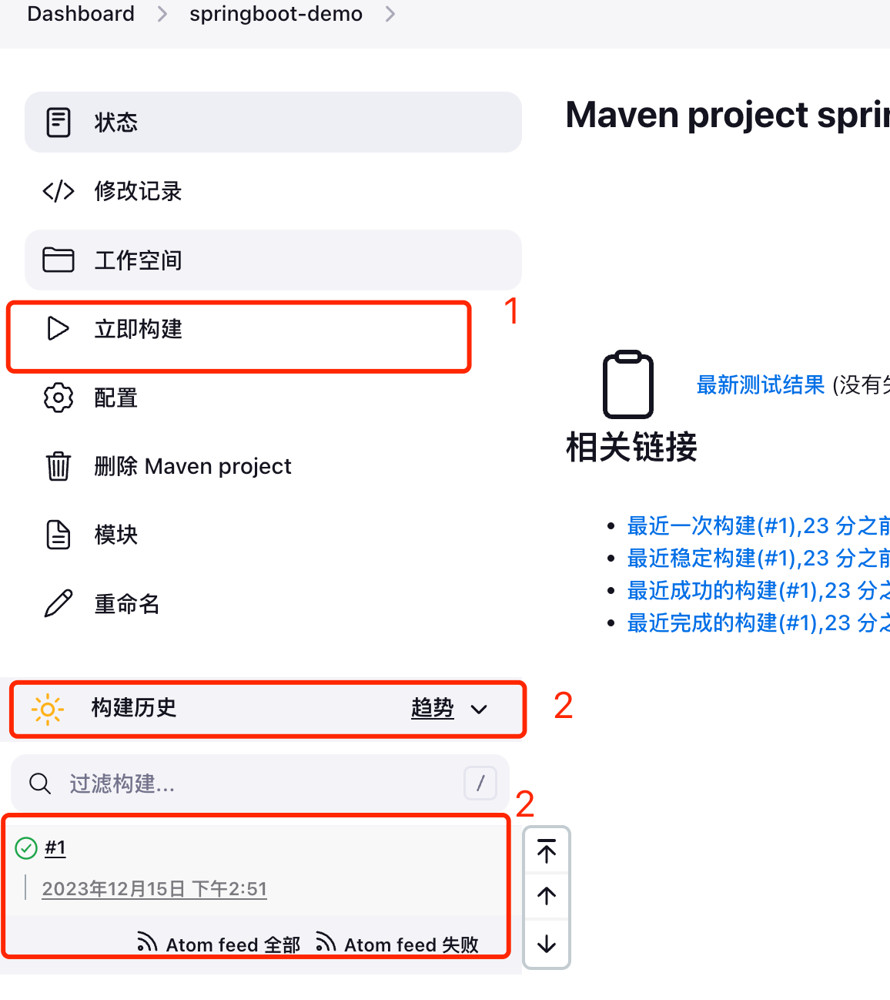

. 点击``立即构建``按钮
. 点击查看``构建历史``
. 点击``构建历史``中的``#1``
.. ❌: 表示构建失败, 中途大概率报错了
.. ✅: 构建成功
.. ⏳: 表示构建中

==== 查看构建结果

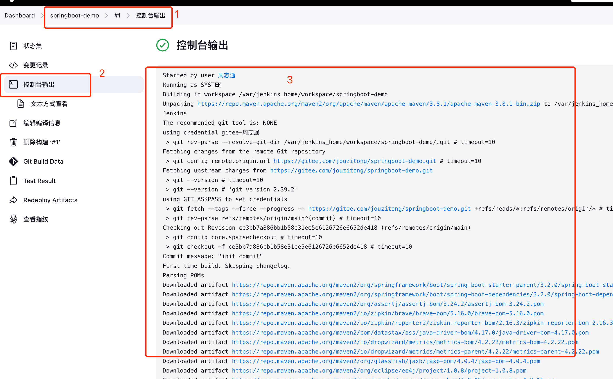

. 点击``构建历史``中的``#1``
. 点击``控制台输出``
. 查看构建日志

=== 可能会出现的问题

. ``git``认证问题, 可能会报``128错误码``
. ``maven``找不到, 可能会报``maven``找不到

== 进阶

.配置详解
下面只讲解关键性的参数(可能会影响编译和部署的配置)，其他参数可以自行百度

.参数格式
. ``${变量名}``: 表示变量(下面有用, 先记着)

=== 常见配置详解

. 参数化构建
** git参数
** 自定义参数(只是数据类型的区别, 都归类于自定义参数)

=== 自动部署(不推荐)

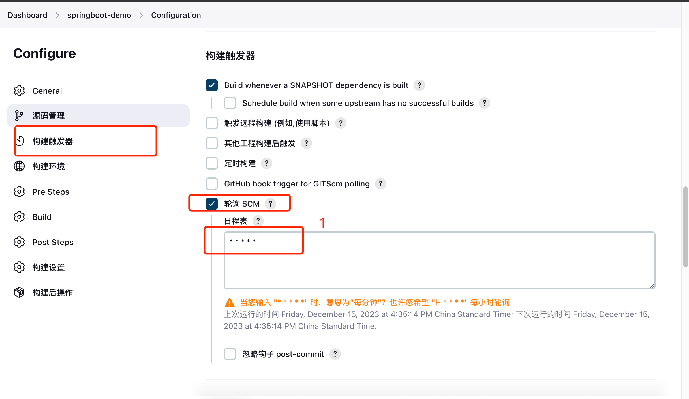

.操作步骤
1. 修改项目配置
2. 修改项目代码, 并提交

[TIP]
====
* 这里我是希望早点触发重新自动构建的的流程, 所以设置了``* * * * *``（表示每分钟检查）. 这个参数根据自己的实际需求去设置.
* 值得注意的是, 自动构建项目可能会失败, 所以在正式环境不建议使用.
====

=== `Git` 配置

.常见需求
. 指定代码仓库
. 仓库认证
. 指定分支

==== 指定代码仓库

填写自己的仓库地址. 如果是``git``或者``gitee``直接填写就好了, 如果是``gitLab``可以先下载插件

==== 仓库认证

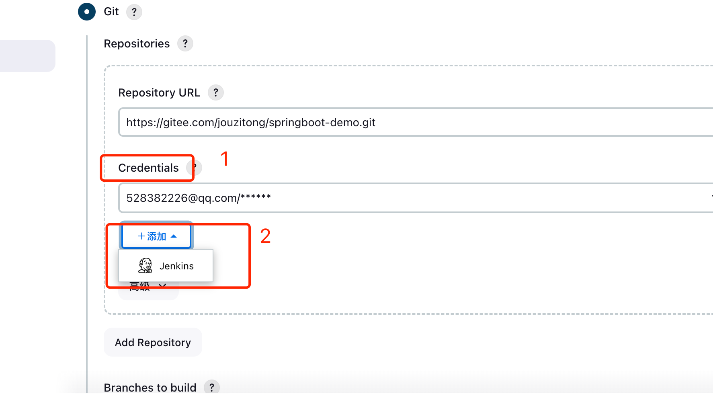

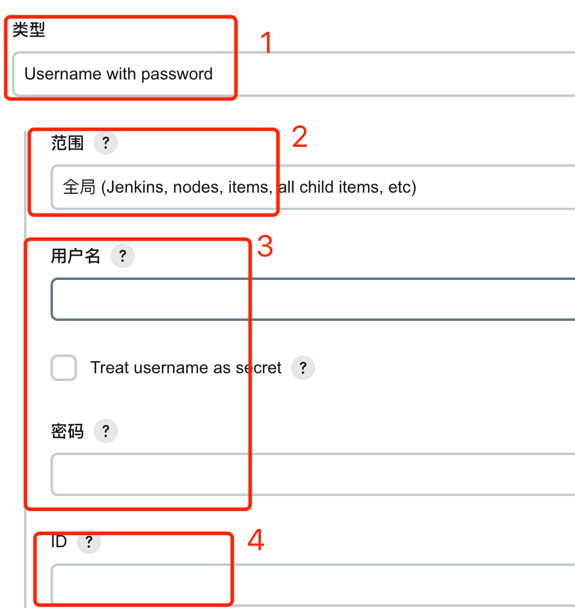

. 认证凭据: 这个有多种认证方式.
.. ``用户名和密码``: 填写自己的``git``或者``gitee``账号密码
.. ``Token``验证: 先在``git``或者``gitee``上生成``token``, 然后填写到这里
. 作用范围: 系统还是全局; 也可以理解为作用域, 一般选择``全局``就行了, 如果需要细分的话, 可以选择``系统``
. 选择认证方式对应显示出来的: 这里选择``用户名和密码``
. ID: 这个是认证凭据的唯一标识, 一般填写自己能看懂的就行了

==== 指定分支

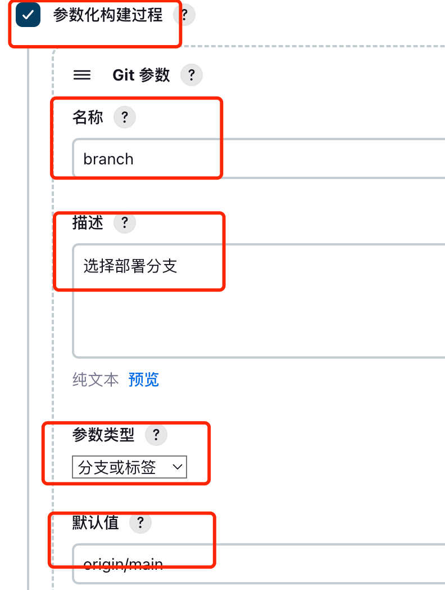

.勾选☑️选择参数构建过程
. 定义参数名称: 根据含义定义好英文名称就行. 这里推荐填写``branch``
. 参数描述: 这个描述自己能看懂就行了
. 参数类型: 这里选择``分支或标签``
. 默认值: 这里填写自己的分支名称, 一般是``origin/main``或者``origin/master``

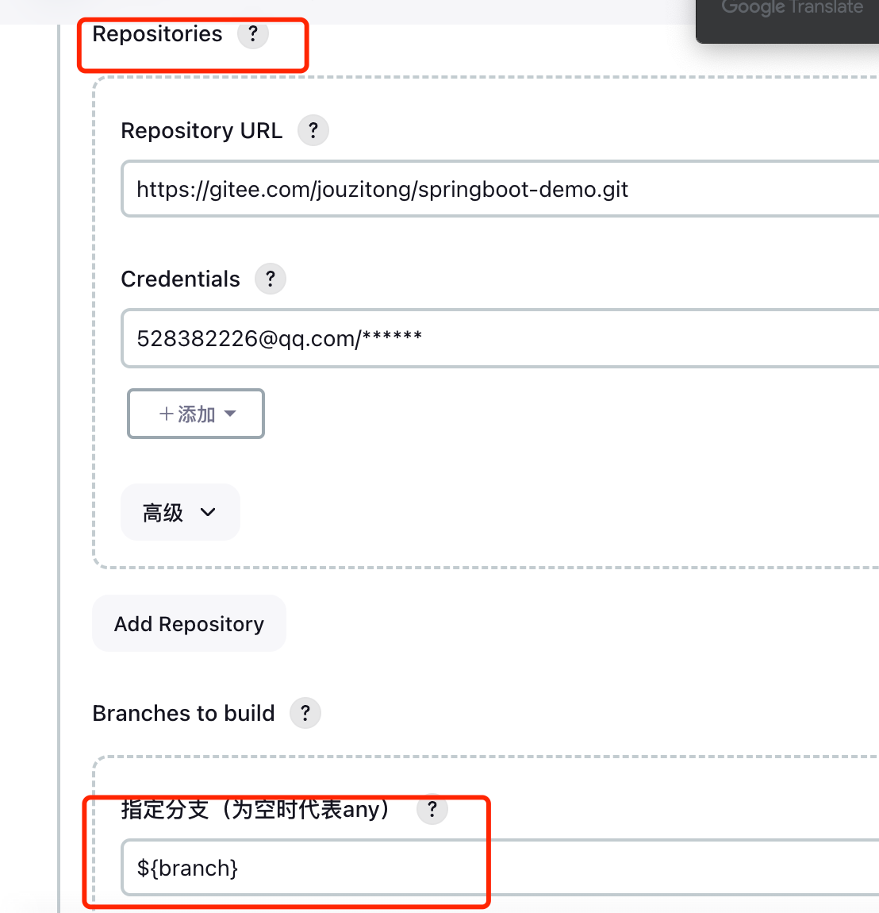

* 在配置仓库时, 会需要指定分支, 这里填写``branch``参数变量, 也就是``${branch}``

'''

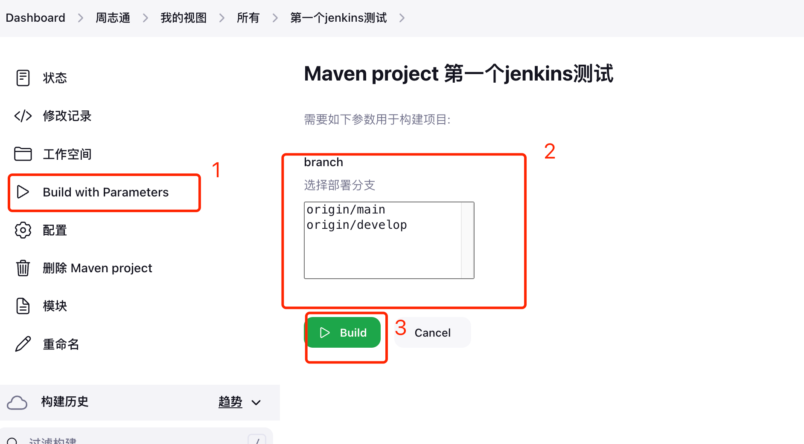

. 开始构建项目
. 选择``branch``分支
. 开始构建

=== `Maven`配置（还未完成）

先用自动安装

=== 代码部署配置

代码在编译后，需要部署到服务器上, 下面开始讲解如何配置

.多种方式
. 通过``SSH``插件
.. ``Over SSH``插件
. 通过``自定义脚本``

==== ``Over SSH``插件

==== Over SSH 插件

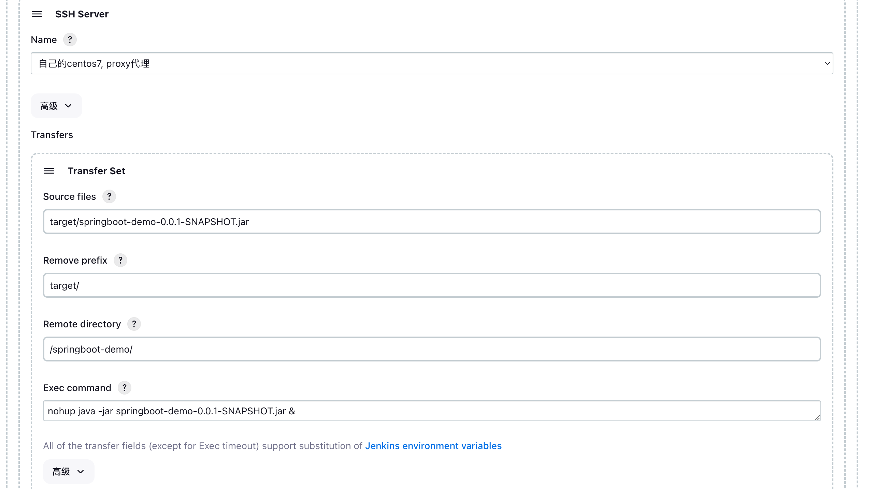

==== 自定义脚本

== Java Api 调用

=== 基本概念

== 面试题

