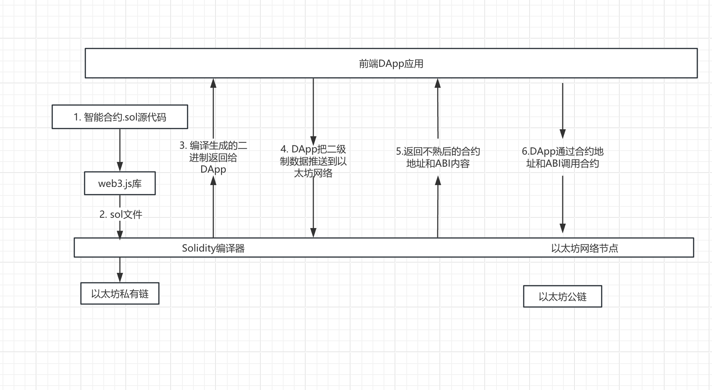
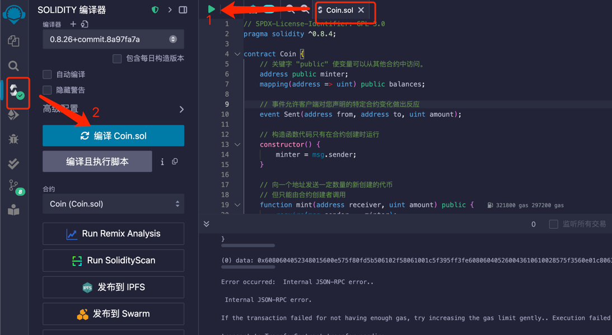

= {toc-title}
:author: JouZiton
:doctype: book
:encoding: UTF-8
:lang: zh-CN
:numbered: 编号
:stem: latexmath
:icons: font
:toc: left
:toc-title: 区块链技术知识
:toclevels: 3
:source-highlighter: coderay
:sectnums:
:sectlinks:
:sectnumlevels: 3

[perfer]
== 前言

* 内容主要由``ChatGPT``生成
* 本文内容主要是介绍区块链技术的基础概念, 并给出一定的解释说明.

.常见的官网地址
* https://archive.trufflesuite.com/[Ganache 官网]
* https://metamask.io/[MetaMask 官网]

learn embark huge
journey skull monster
rude rural leave
plunge cargo trial

== 基础概念

=== 区块链概念

.区块链概念
区块链是一种去中心化的分布式账本，由一系列按照时间顺序连接的区块组成。每个区块包含了一定数量的交易记录，这些记录被加密后存储在网络中的节点上。区块链的特点是去中心化、不可篡改、透明公开。

.区块链的核心组成部分
. 区块
. 链
. 共识
. 智能合约

==== 区块(`Block`)

.概念
区块是区块链的基本数据结构，每个区块包含交易信息，并通过哈希值连接到前一个区块，形成链式结构。

.主要组成部分
- *区块头*（Block Header）
. 区块高度（Height）：表示该区块在区块链中的位置。
. 前一个区块的哈希（Previous Block Hash）：用于保证区块的顺序和完整性。
. 时间戳（Timestamp）：记录区块被挖出的时间。
. Merkle 根（Merkle Root）：用于存储所有交易数据的哈希树根，提高数据完整性和验证效率。
. 难度目标（Difficulty Target）：用于 PoW 机制，控制出块难度。
. 随机数（Nonce）：矿工在 PoW 过程中调整此值以找到符合难度目标的哈希值。

- *区块体*（Block Body）
. 交易列表（Transactions）：包含该区块中所有交易的信息。

- *作用*
. 记录所有交易数据
. 通过哈希链保证数据不可篡改
. 维护交易账本的一致性

.代码表达
[source, solidity]
----
pragma solidity ^0.8.0;
contract Block {
    uint public height;
    bytes32 public previousBlockHash;
    uint public timestamp;
    bytes32 public merkleRoot;
    uint public difficultyTarget;
    uint public nonce;
    Transaction[] public transactions;
    struct Transaction {
        address sender;
        address recipient;
        uint amount;
    }
    // 构造函数
    // 其他函数
}
----

==== 链

.概念
区块链由一系列区块按时间顺序相连而成，每个区块通过哈希指向上一个区块，形成一条不可逆的链。

.主要特点
. 不可篡改：由于哈希链结构，篡改任何一个区块都会导致后续所有区块的哈希值改变，从而破坏整条链。
. 分布式存储：区块链是一个去中心化的账本，所有节点共同维护链上的数据。
. 共识机制保障安全性：区块的添加必须经过共识机制（PoW、PoS 等）验证，确保数据真实可靠。

.作用
. 维持``交易记录``的``顺序``和``一致性``
. 形成数据的``不可篡改性``
. 确保全网节点的``数据一致``

=== 共识机制

.概念
共识机制是区块链网络中所有节点就区块的合法性达成一致的方法。在<<CM, 第三章节>>中, 我们详细介绍了几种常见的共识算法。

.常见共识算法
. <<CM-Pow>>（Proof of Work）
- 通过计算哈希值来竞争记账权，矿工需要消耗计算资源来解决数学难题。
- 代表：比特币、以太坊（ETH 1.0）。
- 缺点：能耗高、交易速度慢。

. <<CM-Poh>>（Proof of History）
- 基于节点持有的历史数据来竞争记账权，持有历史数据越多，参与的概率越大。
- 代表：`Solana`.
- 优点：能源效率高、交易速度快。
- 缺点：数据量过大，容易被少数节点控制。

. <<CM-Pos>>（Proof of Stake）
- 基于节点持有的代币数量来竞争记账权，代币数量越多，参与的概率越大。
- 根据持币数量和持有时间分配记账权，避免 PoW 的高能耗问题。
- 代表：以太坊（ETH 2.0）、比特币现金（BCH）。
- 优点：能源效率高、交易速度快。
- 缺点：代币数量决定了参与的概率，容易被少数节点控制。

. <<CM-DPos>>（Delegated Proof of Stake）
- 基于节点持有的代币数量来竞争记账权，代币数量越多，参与的概率越大。
- 节点持有代币的一部分作为投票权，通过投票来选择记账节点。
- 代表：EOS、NEO。
- 优点：能源效率高、交易速度快，投票权决定了参与的概率。
- 缺点：代币数量决定了参与的概率，容易被少数节点控制。

. <<CM-Pbft>>（Practical Byzantine Fault Tolerance）
- 一种容错机制，通过多个节点之间的通信来达成共识。
- 代表：Hyperledger Fabric。
- 优点：高可用性、容错性强。
- 缺点：通信开销大、扩展性差。

. <<CM-Poa>>（Proof of Authority）
- 基于节点的授权权来竞争记账权，节点被授权后才能参与记账。
- 代表：`Tron`、`Ontology`。
- 优点：能源效率高、交易速度快，节点被授权后才能参与记账。
- 缺点：节点被授权后才能参与记账，容易被少数节点控制。

.作用
. 确保区块数据的``真实性``和``安全性``
. 让去中心化网络达成共识

=== 智能合约

.概念
智能合约是一种运行在区块链上的自动化程序，它能在满足特定条件时执行交易。

.主要特点
. `去中心化`：不依赖中介，自动执行。
. `不可篡改`：部署后无法更改，代码即法律。
. `透明性`：所有人都可以查看智能合约代码。

.常见的智能合约平台
. 以太坊（Ethereum）（Solidity 语言）
. Binance Smart Chain（BSC）
. Polkadot、Solana

.作用
. 使交易和应用程序自动化
. 提供 `DeFi`（去中心化金融）、`NFT`、`DAO` 等应用的基础

=== 区块链分类

. 公有链
. 联盟链
. 私有链

[cols="^,^,^,^"]
|===
| 类别 | 公有链 | 联盟链 | 私有链
| 参与者 | 所有节点都可以参与 | 联盟成员 | 链的所有者
| 共识机制 | `PoW`、`PoS`、`DPoS` | `分布式一致性算法` | `Solo`/`PBFT` 等
| 记账权 | 所有节点 | 联盟协商确定 | 链的所有者
| 奖励机制 | 奖励给矿工 | 可选 | 无
| 中心化程度 | 去中心化 | 弱中心化 | 强中心化
| 交易速度 | < 100 笔/s (比特币 7 TPS，以太坊 30 TPS) | < 10 万笔/s | 视配置决定
| 应用场景 | 虚拟货币市场 | 供应链金融、银行、物流、电商 | 大型组织、机构
| 代表项目 | 比特币、以太坊、`Solana` | `R3`, `Hyperledger` | 未知
|===

==== 公有链

.概念
公有链是完全去中心化的区块链，任何人都可以加入、读取和写入数据。所有交易和数据都是公开透明的，节点通过``共识机制``（如 `PoW`、`PoS`）达成一致。

.特点
- 去中心化：所有节点地位平等，无需许可即可加入网络。
- 完全公开：任何人都可以访问和验证数据，透明度极高。
- 安全性强：依靠共识机制（如 PoW）防止篡改，数据不可逆。
- 吞吐量较低：由于共识机制需要大量计算，交易处理速度较慢（如比特币 7 TPS）。
- 适合数字货币及去中心化应用（DApp）。

.代表项目
- 比特币（Bitcoin）：最早的公有链，使用 PoW 共识机制。
- 以太坊（Ethereum）：支持智能合约和 DApp 的去中心化计算平台。
- Solana：高吞吐量的公链，TPS 高达 50,000.

.适用场景
- 加密货币（`BTC`、`ETH`）
- 去中心化金融（`DeFi`）
- `NFT`（非同质化代币）
- `DAO`（去中心化自治组织）

==== 联盟链

.概念
联盟链是半去中心化的区块链，由多个组织或机构共同管理，节点的权限受到限制，只有授权的参与者才能访问数据。

.特点
- 部分去中心化：由多个机构共同维护，成员需要授权才能加入。
- 交易权限控制：只有授权的节点可以读写数据，数据具有一定隐私性。
- 高吞吐量：由于节点数量有限，共识机制更高效，TPS 较高。
- 可信度高：由于参与者是已知机构，信任度较高，适用于商业应用。
- 适用于企业间协作，不适用于完全去中心化的应用。

.代表项目
- `Hyperledger Fabric`（Linux 基金会支持，企业级区块链平台）。
- `R3 Corda`（银行和金融行业联盟链）。
- `Quorum`（摩根大通开发，基于以太坊的联盟链）。

.适用场景
- 银行间结算（`R3 Corda`）
- 供应链管理（`Hyperledger Fabric`）
- 企业间数据共享（保险、医疗、物流）
- 政府监管（身份管理、税务）

==== 私有链

.概念
私有链是中心化的区块链，只有特定的组织或公司能够访问，所有的节点和数据都由一个组织管理。

.特点
- 完全中心化：仅由一个组织控制，外部用户无法访问。
- 高隐私性：数据仅限于内部使用，不能被外部查看。
- 高吞吐量：由于没有外部竞争，共识效率高，TPS 最高。
- 不具备去中心化特性：依赖中心管理，若中心节点崩溃，系统可能失效。
- 适用于企业内部数据管理，不适用于去中心化应用。

.代表项目
- Hyperledger Fabric（可用作私有链）
- Quorum（也可作为私有链运行）
- 企业内部定制区块链

.适用场景
- 企业内部数据管理（财务、审计）
- 身份认证系统（政府、企业）
- 内部资产管理（银行、证券）

=== 区块链平台

.虚拟货币
. `比特币`
. `以太坊`
. `Solana`

.去中心化应用
. `龙链`
. `Hyperledger`
. `EOS`
. `Libra`
. `BaaS`

[cols="^,^,^,^"]
|===
| 特性 | 比特币（BTC） | 以太坊（ETH） | Solana（SOL）
| 代币 | BTC | ETH | SOL
| 共识机制 | PoW | PoS | PoH + PoS
| 智能合约 | ❌ 不支持 | ✅ 支持 Solidity | ✅ 支持 Rust/C
| 区块时间 | 10 分钟 | 12 秒 | 400ms
| TPS（交易吞吐量） | 7 | 30 | 50,000+
| 交易费用 | 高（矿工费） | 高（Gas 费） | 低（< $0.01）
| 适用场景 | 数字货币、价值存储 | DeFi、NFT、智能合约 | 高速 DeFi、NFT、游戏
| 安全性 | 高（最安全） | 高 | 相对较新，尚在验证
|===

==== 比特币

.概述
比特币是世界上第一个区块链项目，于 2008 年由中本聪（Satoshi Nakamoto）提出，2009 年正式上线。它主要用于 点对点（P2P）电子现金系统，目的是创建去中心化的、无需信任的电子货币。

.核心特点
- 去中心化：无中心机构控制，所有交易记录都由全球节点维护。
- PoW 共识机制：采用工作量证明（Proof of Work），矿工通过算力竞争来记账。
- 固定供应量：比特币总量恒定 2100 万枚，防止通货膨胀。
- 抗审查性：没有政府或机构可以阻止交易。
- 交易速度慢：每个区块时间 10 分钟，TPS（每秒交易量）约 7。
- 不支持智能合约：比特币的脚本语言有限，无法编写复杂的智能合约。

.技术栈
- *共识机制*：PoW（SHA-256 算法）
- *区块大小*：1 MB（扩容方案如 SegWit、闪电网络）
- *区块时间*：10 分钟
- *交易速度*：约 7 TPS

.适用场景
- 数字货币（BTC）
- 价值存储（数字黄金）
- 低频交易的支付系统（如大额跨境支付）

==== 以太坊

.概述
以太坊是第二代区块链，由Vitalik Buterin 于 2015 年发布，它不仅仅是一个支付网络，还支持 智能合约（Smart Contracts） 和 去中心化应用（DApps）。

.核心特点
- 支持智能合约：使用 Solidity 语言编写合约，实现去中心化应用（DApp）。
- EVM（以太坊虚拟机）：提供运行智能合约的计算环境。
- 从 PoW 转向 PoS：以太坊 1.0 采用 PoW，以太坊 2.0 已升级为 PoS，提高扩展性。
- 交易速度比比特币快：每个区块 约 12 秒，TPS 约 30。
- 高 Gas 费用：以太坊的交易费用（Gas 费）较高，特别是在网络拥堵时。

.技术栈
- 共识机制：PoW（ETH 1.0），PoS（ETH 2.0）
- 智能合约语言：`Solidity`
- 区块时间：约 12 秒
- 交易速度：约 30 TPS（升级后更高）
- Layer 2 解决方案：如 Rollup（Optimistic Rollup, ZK-Rollup）

.适用场景
- 智能合约平台（如 NFT、DeFi 应用）
- 去中心化金融（DeFi）（如 Uniswap, Aave）
- DAO（去中心化自治组织）
- NFT 交易（如 OpenSea, Rarible）

==== `Solana`

.概述
Solana 是第三代区块链，由 Anatoly Yakovenko 于 2020 年推出，以 高性能和低成本 为目标，主要用于高吞吐量的去中心化应用（DApps）。

.核心特点
- 高吞吐量：使用独特的 PoH（Proof of History）+ PoS 共识机制，TPS 高达 50,000。
- 低交易成本：交易费用远低于以太坊（通常小于 $0.01）。
- 秒级确认：区块时间 400ms，比以太坊更快。
- 适合大规模应用：如 DeFi、游戏、NFT。
- 智能合约语言：Rust 和 C/C++，比 Solidity 更高效，但生态较小。

.技术栈
- 共识机制：`PoH` + `PoS`
- 智能合约语言：`Rust`、`C`
- 区块时间：约 400ms
- 交易速度：*50,000+ TPS*
- 交易费用：远低于以太坊

.适用场景
- 高频交易应用（如去中心化交易所 `Serum`）
- `NFT` 市场（如 `Magic Eden`）
- 区块链游戏（如 `Star Atlas`）
- `DeFi`（如 Raydium, Saber）

=== 区块链现状和展望

// TODO

.区块链技术的现状
- 区块链技术在金融、供应链、医疗等领域得到广泛应用。
- 区块链技术的安全性和隐私性面临挑战。
- 区块链技术的应用场景和生态系统还在不断发展。

.区块链技术的未来展望
- 区块链技术将继续发展，如 `Layer 2` 解决方案、`NFT` 技术等。
- 区块链技术将与人工智能、物联网等技术相结合，实现更智能、更安全的应用。
- 区块链技术将与传统金融、医疗等行业相结合，实现更高效、更安全的业务。

== 区块链核心技术

.核心技术
. *<<CT-Hash>>*: MD5、SHA-256、Keccak
. *<<CT-Merkle>>*(Merkle Tree): 用于数据完整性验证
. *<<CT-DL>>*(Distributed Ledger): 去中心化存储数据的方式
. *<<CT-Enc>>* & *数字签名*: `ECDSA` 椭圆曲线加密
. *共识算法*: `PoW`、`PoS`、`DPoS`. 详情见<<CM, 共识机制>>相关章节
. *智能合约*: 智能合约是一种在区块链上运行的程序，它可以自动执行预定义的操作，无需中介的干预. 详情见<<SmartContract>>相关章节

=== 哈希函数 [[CT-Hash]]

.概念
哈希是一种加密算法，用于将任意长度的数据转换为固定长度的字符串，具有不可逆性。当前常用的哈希函数以``MD``和``SHA``系列为主.

.常见哈希算法
. `MD5`
. `SHA-1`(不安全, 建议使用``SHA2``)
. `SHA-256`（比特币使用）
. `Keccak-256`（以太坊使用）

.`SHA-256` 代码案例
[source, rust]
----
SHA-256("Hello") -> 185f8db32271fe25f561a6fc938b2e264306ec304eda518007d1764826381969
----

.关键特点
- *确定性*: 相同的输入始终产生相同的输出。
- *不可逆性*: 无法从哈希值反推出原始数据。
- *高效计算*: 哈希计算必须快速，无论输入数据多大，计算哈希值的时间应保持可控。
- *固定长度输出*: 输出长度固定，通常为 256 位。
- *抗碰撞性*: 难以找到两个不同的输入 A ≠ B，但 Hash(A) == Hash(B)。（虽然理论上碰撞可能存在，但计算成本极高）
- *雪崩效应*: 输入的微小变化会导致输出的显著变化。
- *抗篡改性*: 区块链利用哈希函数对区块内容进行哈希计算，每个区块都包含前一个区块的哈希值，从而确保篡改任何一个区块都会导致整条链失效。

.作用
- 确保数据完整性（改变交易内容会导致哈希值改变）
- 通过哈希指针形成区块链结构
- 在 `PoW` 机制中作为挖矿难题（找到符合难度要求的哈希值）

.主要哈希算法及其实现
[cols="^,^,^,^,^"]
|===
| 哈希算法 | 输出长度 | 特点 | 主要用途 | 适用场景
| `MD5` | 128 位 | 计算速度快，但已被破解(存在碰撞攻击) | 校验数据完整性 | 已不安全，用于旧版密码存储、文件校验
| `SHA-1` | 160 位 | 比 MD5 更安全，但已被攻击破解（谷歌在 2017 年成功找到碰撞） | 早期数字签名 | 已不安全，用于旧版 HTTPS 证书、GPG 签名
| `SHA-256` | 256 位 | 安全性高，目前没有可行的碰撞攻击 | 比特币区块链 | 比特币区块链、数字签名
| `SHA-3` | 224/256/384/512 位 | 比 SHA-256 更抗攻击，已用于以太坊（Ethereum） | 以太坊哈希算法 | 以太坊哈希算法、智能合约、区块链
| `BLAKE2` | 256 位 | 高效哈希算法，比 SHA-256 更快 | 高效哈希算法 | 密码学、数字签名
| `RIPEMD-160` | 160 位 | 适用于比特币地址生成，比 `SHA-256` 短，但安全性较高 | 比特币地址生成 | 数字货币地址生成
|===

==== MD系列

// TODO

==== SHA系列

// TODO

=== 默克尔树 [[CT-Merkle]]

.概念
- **默克尔树**是一种**二叉树**，每个叶子节点都代表一个数据块，每个非叶子节点都代表其两个子节点的哈希值。
- *默克尔树*（`Merkle Tree`）是区块链技术的核心数据结构之一，它用于高效、安全地验证大规模数据的完整性。*比特币*、*以太坊* 等区块链都使用默克尔树来存储和验证交易。

.作用
. (高效)验证大规模数据完整性。
** 默克尔树可以快速验证某个数据是否包含在一个大数据集中，而不需要下载所有数据。例如，区块链钱包可以仅下载区块头来验证交易，而无需存储整个区块数据。
. 降低存储需求
** 通过存储根哈希值（Merkle Root），可以唯一标识整个数据集，而无需存储所有数据，提高区块链的存储效率。
. 提供快速数据校验
** 任何数据变更都会导致哈希值变化，默克尔树可用于检测数据是否被篡改。例如，比特币节点可以通过对比默克尔根（Merkle Root）检测区块是否完整。
. 实现轻量级节点（SPV, Simplified Payment Verification）
** 轻节点只需要存储区块头中的 Merkle Root，并通过默克尔路径（Merkle Path）验证交易是否包含在区块中，而不需要下载整个区块。

==== 结构

- 默克尔树是一棵二叉树，叶子节点存储交易的哈希值，非叶子节点存储子节点哈希值的组合计算结果。

.示例
假设有**4笔交易**（`Tx1`、`Tx2`、`Tx3`、`Tx4`），默克尔树的构造过程如下：
[source, markdown]
----
         Merkle Root
        /          \
   Hash_AB       Hash_CD
   /      \      /      \
Hash_A  Hash_B  Hash_C  Hash_D
 |        |      |        |
Tx1      Tx2    Tx3      Tx4
----

- 计算叶子节点的哈希值:
[source, ini]
----
Hash_A = SHA-256(Tx1)
Hash_B = SHA-256(Tx2)
Hash_C = SHA-256(Tx3)
Hash_D = SHA-256(Tx4)
----

- 计算非叶子节点的哈希值:
[source, ini]
----
Hash_AB = SHA-256(Hash_A + Hash_B)
Hash_CD = SHA-256(Hash_C + Hash_D)
----

- 计算根节点的哈希值:
[source, ini]
----
Merkle Root = SHA-256(Hash_AB + Hash_CD)
----

这样，`Merkle Root` 就代表了整个交易集合的唯一性，任何一个交易被篡改，都会导致 `Merkle Root` 变化。

==== 默克尔树的实现 -- `Python`

.代码实现
[%collapsible]
====
[source, python]
----
import hashlib
from typing import List

# 计算 SHA-256 哈希
def sha256(data: str) -> str:
    return hashlib.sha256(data.encode()).hexdigest()

# 生成默克尔树
class MerkleTree:
    def __init__(self, transactions: List[str]):
        self.transactions = transactions
        self.tree = self.build_merkle_tree(transactions)

    def build_merkle_tree(self, transactions: List[str]) -> List[List[str]]:
        """构建默克尔树，并返回所有层级的哈希值"""
        if not transactions:
            return []

        # 计算叶子节点哈希
        tree = [[sha256(tx) for tx in transactions]]

        # 构造树的每一层
        while len(tree[-1]) > 1:
            current_level = tree[-1]
            next_level = []
            # 如果节点数是奇数，则复制最后一个节点，使其成为偶数
            if len(current_level) % 2 == 1:
                current_level.append(current_level[-1])

            # 计算父节点哈希值
            for i in range(0, len(current_level), 2):
                combined_hash = sha256(current_level[i] + current_level[i+1])
                next_level.append(combined_hash)

            tree.append(next_level)

        return tree

    def get_merkle_root(self) -> str:
        """返回默克尔根"""
        return self.tree[-1][0] if self.tree else None

    def get_merkle_path(self, transaction: str) -> List[str]:
        """获取默克尔路径（Merkle Path）"""
        hashed_tx = sha256(transaction)
        path = []
        index = self.tree[0].index(hashed_tx) if hashed_tx in self.tree[0] else -1

        if index == -1:
            return []  # 交易不存在

        for level in self.tree[:-1]:
            is_right_node = index % 2
            pair_index = index - 1 if is_right_node else index + 1
            if pair_index < len(level):
                path.append(level[pair_index])
            index //= 2

        return path

# 示例数据
transactions = ["Tx1", "Tx2", "Tx3", "Tx4"]
merkle_tree = MerkleTree(transactions)

# 输出默克尔根
print("Merkle Root:", merkle_tree.get_merkle_root())

# 获取某个交易的默克尔路径
tx_to_check = "Tx2"
merkle_path = merkle_tree.get_merkle_path(tx_to_check)
print(f"Merkle Path for {tx_to_check}:", merkle_path)
----
====

==== 实际案例: 比特币交易默克尔树

.比特币的区块头（Block Header）包含 Merkle Root，用于验证交易的完整性：
[source, markdown]
----
比特币区块头结构:
-------------------------------------------------
| Version | Previous Block Hash | Merkle Root   |
|-----------------------------------------------|
| Time    | Bits | Nonce |                      |
-------------------------------------------------
----

- `Merkle Root` 由区块内所有交易计算得出。
- *轻节点*（SPV 钱包）可以仅存储区块头，并通过 `Merkle Path` 验证某个交易是否存在。

===== 实际案例: 以太坊默克尔 帕特里夏树

.以太坊使用了一种更高级的默克尔帕特里夏树（Merkle Patricia Tree, MPT），用于存储：
. 交易树（Transactions Tree）
. 状态树（State Tree）
. 收据树（Receipts Tree）

与比特币的默克尔树不同，以太坊的 MPT 支持动态更新，适用于智能合约状态存储。

===== 总结

=== 分布式账本 [[CT-DL]]

// TODO 待补充

.概念
- 分布式账本是一种去中心化的数据存储方式，它通过多个节点共同维护一份共享的数据记录，保证数据的安全性、一致性和不可篡改性。在分布式账本中，每个节点存储账本的副本，并通过共识机制来验证和同步数据，而无需依赖单一的中心机构。
- 分布式账本的代表技术就是区块链，但分布式账本的概念比区块链更广，区块链是一种特殊形式的分布式账本。

.核心功能
. *数据去中心化*
** 账本数据不存储在单一服务器上，而是分布在多个节点之间，避免单点故障，提高系统的可靠性。
. *数据不可篡改*
** 采用密码学哈希函数和共识机制，使得数据一旦记录，便难以更改或删除，保障数据的完整性。
. *交易可验证*
** 账本中的每笔交易都可以被所有参与者验证，提高透明度和可审计性。
. *分布式共识*
** 通过**PoW（工作量证明）、PoS（权益证明）、PBFT（实用拜占庭容错）**等共识机制，让所有节点就账本内容达成一致。
. *智能合约支持*
** 允许在账本上运行自动执行的程序（智能合约），以执行预设规则，减少人工干预。

==== 具体实现方案

===== 区块链（Blockchain）

*代表项目*：比特币、以太坊、Hyperledger Fabric

.核心特点：
- *数据结构*：区块链是按区块（Block）组织的链式结构，每个区块包含前一个区块的哈希值，形成不可篡改的链条。
- *共识机制*：
** 比特币采用 PoW（工作量证明），通过挖矿竞争记账。
** 以太坊正在转向 PoS（权益证明），减少能源消耗。
** **联盟链（如 Hyperledger Fabric）**采用 PBFT（拜占庭容错），适用于企业级应用。

.*应用场景*：
* 数字货币（如比特币、USDT）
* 去中心化金融（DeFi）
* NFT（非同质化代币）
* 智能合约执行

===== DAG（有向无环图）

*代表项目*：IOTA、Nano、Hashgraph

.核心特点：
* 数据结构：DAG（Directed Acyclic Graph）采用网状结构，而不是线性区块结构，每个交易直接引用多个前序交易。
* 无矿工模式：
** 交易者本身参与交易验证，而非依赖矿工竞争。
** 适用于高并发、低手续费的应用，如物联网（IoT）支付。
* 高扩展性：
** 交易吞吐量高（TPS 比区块链更高）。
** 无需等待整个网络确认，适合微支付场景。

.应用场景：
* 物联网支付（IOTA）
* 高频交易（Nano）
* 低延迟应用（Hashgraph）

=== 加密算法 [[CT-Enc]]

.概念
区块链使用密码学技术来确保交易的安全性和数据的不可篡改性。

.常见加密算法
. *对称加密*
. *非对称加密*
. *哈希加密*

.作用
- 保障交易安全性
- 防止伪造交易
- 保护用户隐私

==== 对称加密

.特点：
* 加密和解密使用**相同的密钥**。
* 速度快，适用于大规模数据加密
* 需要安全地共享密钥，否则可能被窃取。

.常见对称加密算法
|===
| 算法 | 密钥长度 | 适用场景 | 安全性
| `AES` | 128/192/256 位 | HTTPS、区块链钱包加密、数据库加密 | 高（推荐）
| `DES` | 56 位 | 旧系统 | 低（已淘汰）
| `3DES` | 168 位 | 金融领域 | 中等（被 AES 替代）
| `ChaCha20` | 256 位 | 移动设备、TLS 加密 | 高（轻量级）
| `Blowfish` | 32-448 位 | VPN、数据库加密 | 高
|===

.总结
* 对称加密是一种快速、高效的加密方式，适用于大规模数据加密;
* 密钥的安全性至关重要，需要妥善保管，避免被窃取;
* 安全性低, 容易被破解.

==== 非对称加密

.特点
- *公钥*（Public Key）：可公开分享，用于**加密数据**或**验证签名**。
- *私钥*（Private Key）：必须保密，用于**解密数据**或**生成签名**。
- 计算速度慢，适用于小数据量（如加密密钥、身份认证）。

.常见非对称加密算法
|===
| 算法 | 密钥长度 | 适用场景 | 安全性
| `RSA` | 1024/2048/4096 位 | 身份认证、HTTPS、数字签名 | 高（推荐，较慢）
| `ECC` | 256/384/521 位 | 	区块链、TLS 加密 | 高（轻量级，更快）
| `DSA` | 1024/2048 位 | 数字签名 | 高
| `ElGamal` | 1024/2048 位 | 	电子投票、身份认证 | 高
|===
.总结

.应用模式
. *加密模式*: 使用公钥加密数据，只有持有私钥的人才能解密。
. *数字签名*: 使用私钥生成签名，公钥用于验证签名。

.特点
- 加密和解密使用不同的密钥。
- 公钥用于加密，私钥用于解密。
- 安全性高，因为攻击者无法使用公钥解密数据。

.应用场景
- 数据加密
- 数字签名
- 密钥交换

.*具体示例*
[%collapsible]
====
.需求:
- 生成密钥对（公钥和私钥）
- 使用公钥加密数据
- 使用私钥解密数据

.代码实现
[source, python]
----
import hashlib
from typing import List

# 生成密钥对
def generate_key_pair(public_key, private_key):
    # 生成私钥
    private_key = hashlib.sha256(private_key).hexdigest()
    # 生成公钥
    public_key = hashlib.sha256(public_key).hexdigest()
    return private_key, public_key

# 加密数据
def encrypt_data(data, public_key):
    # 使用公钥加密数据
    encrypted_data = hashlib.sha256((data + public_key).encode()).hexdigest()
    return encrypted_data

# 解密数据
def decrypt_data(encrypted_data, private_key):
    # 使用私钥解密数据
    decrypted_data = hashlib.sha256((encrypted_data + private_key).encode()).hexdigest()
    return decrypted_data

# 示例数据
private_key = "my_private_key"
public_key = "my_public_key"

# 生成密钥对
private_key, public_key = generate_key_pair(public_key, private_key);

# 加密数据
data = "Hello, World!"
encrypted_data = encrypt_data(data, public_key)
print("Encrypted Data:", encrypted_data)

# 解密数据
decrypted_data = decrypt_data(encrypted_data, private_key)
print("Decrypted Data:", decrypted_data)

----
====

.注意
- 在实际应用中, 传输数据不仅要数据加密传输, 防止数据泄漏; 还要数据签名传输, 防止数据篡改. 所以, 签名也是必不可少的一部分.

==== 哈希加密

哈希算法特点、常见实现等功能<<CT-Hash, 见上文>>。

== 共识机制 [[CM]]

.概念
- 区块链的核心技术之一，用于确保网络中的节点达成一致，维护区块链的稳定性和安全性。
- 不同的区块链系统采用不同的共识算法，如 *PoW、PoS、DPoS、PBFT* 等。

.常见共识机制
. `PoW`(工作量证明):
. `Pos`(权益证明):
. `DPos`(委托权益证明):
. `PoH`(历史证明):
. `PBFT`(拜占庭容错):
. `PoA`(授权证明):

.#问题和思考#
. 每种共识机制的核心机制是什么？
. 全网节点如何确定数据一致性的？
. 数据确定一致时, 会遭受到什么攻击？又该如何防护？

=== ``PoW``(工作量证明) [[CM-Pow]]

.什么是工作量证明？
工作量证明（Proof of Work, PoW）是一种共识机制，用于防止网络攻击、确保去中心化系统的安全性。PoW 要求网络参与者（矿工）进行大量计算，以解决一个数学难题，才能获得记账权（打包区块的权利）。

.核心思想
- 让节点通过**计算哈希值**来竞争记账权。
- 计算必须足够困难，但验证过程要**快速且低成本**。
- 通过消耗**算力和电力**，防止网络被恶意控制。

.优点
. *安全性高*：攻击者必须控制超过 51% 的算力才能篡改区块链，成本极高。
. *去中心化*：任何矿工都可以竞争挖矿权，防止单一机构控制网络。
. *抗审查性*：PoW 允许匿名参与，不依赖中心机构。

.缺点
. *能耗巨大*：比特币挖矿消耗大量电力（目前全球挖矿耗电量接近一个中等国家）。
. *交易吞吐量低*：比特币 TPS（每秒交易处理能力）仅 7，远低于传统支付系统（如 Visa）。
. *中心化风险*：大规模矿场和矿池的出现，使算力集中，削弱去中心化。

==== 基本流程

[%collapsible, title="基本流程（以比特币为例）"]
====
. *广播交易*
** 用户发起交易（如 A 向 B 转账 1 BTC）
** 交易被广播到网络中的节点。
. *矿工收集交易并组装成区块*
** 矿工节点会收集未确认的交易，并将它们放入一个区块（Block）。
** 区块头中包含：
*** 前一个区块的哈希值
*** Merkle Root（默克尔树根）（所有交易的哈希值组合）
*** 随机数（Nonce）
*** 时间戳
*** 难度目标
. *计算哈希值*
** 矿工通过不断调整随机数（Nonce），计算区块的哈希值: Hash(区块头) < 目标难度目标
** 哈希值必须满足难度目标，即哈希值的前几位必须是 0。
** 这意味着矿工要不断**调整随机数**（Nonce），计算新的哈希值，直到满足条件: `Hash=SHA-256(区块数据 + Nonce)`
** 由于哈希值的输出是**不可预测**的，矿工只能不断尝试不同的 Nonce，直到找到符合难度的**哈希值**。
. *找到正确哈希值并广播*
** 一旦矿工找到符合难度目标的哈希值，就会广播该区块给网络中的其他节点。
. 其他节点验证区块
** 其他节点快速验证：
*** 区块哈希值是否符合难度要求
*** 交易是否有效
** 通过验证后，该区块被加入到区块链。
. 奖励机制
** 矿工成功挖出区块后：
*** 获得 *比特币奖励*（*区块奖励* + *交易手续费*）.
*** 目前比特币的区块奖励约为 *6.25 BTC*（每四年减半）.

====

.计算难度和调整机制
为了保持比特币网络的稳定性，每 *2016 个区块（约两周）*，比特币会自动调整 PoW 难度：

* 如果区块生成太快（低于 10 分钟/块）→ 提高难度。
* 如果区块生成太慢（高于 10 分钟/块）→ 降低难度。

比特币的目标是让每个区块的生成时间保持在 10 分钟左右。

=== ``Pos``(权益证明) [[CM-Pos]]

.什么是 PoS（权益证明）？
权益证明（*Proof of Stake, PoS*） 是一种区块链共识机制，它通过持币量和持币时长来决定谁有权利验证交易和打包新区块。与 `PoW`（工作量证明）不同，`PoS` 不依赖矿工消耗算力挖矿，而是让持币者（验证者）通过**抵押（Staking）**加密货币获得记账权，从而大幅降低能源消耗，提高交易效率。

==== 工作原理

.`PoS` 机制的主要步骤如下：
. 质押（*Staking*）
** 用户锁定一定数量的代币作为押金（*Stake*）。
** 这些用户成为验证者（*Validator*），负责区块验证和交易打包。
. 选择区块生产者
** 系统根据某些规则（如持币数量、持币时间）随机选出一个验证者来生成新区块。
** 可能的选择方式：
*** 币龄（*Coin Age*）：持币时间越长，被选中的概率越高。
*** 随机加权（*Weighted Randomness*）：持币数量越多，概率越高，但仍有随机性。
. 区块验证
** 被选中的验证者创建新区块并广播到网络中。
** 其他验证者检查区块是否符合规则，并投票确认。
. 奖励与惩罚
** 奖励：成功生成区块的验证者可获得交易手续费作为奖励（PoS 通常没有区块奖励）。
** 惩罚（*Slashing*）：
*** 如果验证者作恶（如提交无效交易），押金可能会被部分或全部罚没。
*** 不活跃的验证者（未按时参与共识）可能会受到轻微惩罚，如减少收益。

==== 优缺点

.优点
. 节能环保：不需要像 PoW 那样消耗大量电力计算哈希值。
. 提高交易速度：PoS 区块链通常具有更高的 TPS，更适合大规模应用（如 Solana）。
. 更低的中心化风险：避免了 PoW 矿池的垄断问题，让更多个人用户有机会成为验证者。
. 更安全：攻击者需要持有大量代币来控制网络，这样做本身会导致币价下跌，自损利益。

.缺点
. 富者更富（Wealth Concentration）：
** 持有更多代币的人更容易获得区块奖励，导致资源集中在早期持币者手中。
. 低安全性风险：
** 若大多数验证者勾结（51% 攻击），他们可以操纵交易。
** 但由于 PoS 机制会罚没作恶者的质押资金，因此攻击成本仍然很高。
. 低参与度风险：
** 持币者如果不参与质押，可能会降低区块链的去中心化程度。

==== `PoS` 的变种

PoS 经过发展，衍生出多个不同的改进版本：

.🔹 1. DPoS（委托权益证明，Delegated Proof of Stake）
* 由持币者投票选出**代表（Delegates）**来负责交易验证和区块生产。
* 优点：TPS 高，效率比 PoS 更高（如 EOS 可达 4000+ TPS）。
* 缺点：易形成“寡头政治”，导致中心化。
* 👉 代表区块链：`EOS`、`TRON`、`Steem`

.🔹 2. LPoS（租赁权益证明，Leased Proof of Stake）
* 持币者可以将自己的代币租赁给其他节点，而无需自己运行节点。
* 优点：降低参与门槛，普通用户也能享受质押收益。
* 👉 代表区块链：`Waves`

.🔹 3. NPoS（提名权益证明，Nominated Proof of Stake）
* 持币者（提名者）可以支持自己信任的验证者，分摊奖励和风险。
* 优点：提高安全性，鼓励良性竞争。
* 👉 代表区块链：`Polkadot`（波卡）

.🔹 4. PoS+BFT（权益证明+拜占庭容错，Byzantine Fault Tolerance）
* 结合 PoS 和 BFT（拜占庭容错），提高共识速度和安全性。
* 优点：更适合大规模商用应用，如金融交易。
* 👉 代表区块链：`Cosmos`、`Tendermint`、`Algorand`

==== 常见应用

[cols="^,^,^,^"]
|===
| 区块链 | PoS 机制 | 质押币种 | 主要特点
| 以太坊 2.0 | 纯 PoS | ETH | 采用 Casper 共识机制，支持智能合约
| Solana | PoS + PoH（历史证明） | SOL | 超高 TPS（6 万+），低手续费
| Cardano | 纯 PoS | ADA | 高度去中心化，Ouroboros 共识算法
| Polkadot | NPoS（提名 PoS） | DOT | 可互操作的多链网络
| Cosmos | PoS + BFT | ATOM | 高度可扩展，支持跨链通信
| EOS | DPoS | EOS | 高吞吐量，支持 DApp 生态
|===

.`PoS` vs `PoW` 对比
|===
|  | PoW（工作量证明） | PoS（权益证明）
| 能源消耗 | 高（矿机消耗电力） | 低（不需要矿机）
| 区块生产者 | 矿工（算力竞争） | 持币者（随机选择）
| 去中心化程度 | 高（算力分散） | 可能被大户垄断
| 攻击成本 | 需要控制 51% 算力 | 需要持有 51% 代币
| 交易速度 | 慢（TPS 低，如比特币 7 TPS） | 快（TPS 高，如 Solana 6 万 TPS）
| 代表区块链 | 比特币、以太坊 1.0 | 以太坊 2.0、Solana、Cardano
|===

==== 总结

.PoS 是 PoW 的节能替代方案，主要通过持币抵押（Staking）来维护网络安全。
* PoS 具有更高的 TPS（交易吞吐量），但可能带来富者恒富的风险。
* 不同区块链对 PoS 进行了改进，如 DPoS、NPoS、PoS+BFT，适用于不同应用场景。
* 以太坊 2.0 采用 PoS，将彻底告别 PoW，提高交易效率，降低能源消耗。

=== ``DPos``(委托权益证明) [[CM-DPos]]

.什么是 DPoS（委托权益证明）？
委托权益证明（Delegated Proof of Stake，DPoS） 是由 Daniel Larimer（BM） 在 2014 年提出的一种改进版的 权益证明（PoS） 共识机制。DPoS 允许代币持有者投票选出少量代表（Delegates）或验证者（Validators），由他们负责验证交易和生成区块，从而提高效率、降低交易确认时间。

.关键特点
* *持币者投票*：用户无需自己运行节点，而是将投票权委托给可信的验证者。
* *少量验证者*：通常 10~100 名，远少于 PoS 的去中心化节点数量，提高了吞吐量（TPS）。
* *高效率*：比 PoS 和 PoW 更快，TPS 可达 1000+，甚至 4000+。
* *动态调整*：如果某个代表作恶或效率低下，持币者可以随时撤销投票，换掉验证者。

==== DPoS 工作原理

. *选举验证者*（生产者）
* 每个 DPoS 网络会设定固定数量的区块生产者，如：
** EOS：21 个超级节点
** TRON：27 个超级代表
** Steem：20 个见证人
* 所有代币持有者可以用他们的代币投票选出区块生产者。
* 票数最多的节点成为验证者，获得记账权并负责生成新区块。
. *区块生产*
* 每个当选的验证者按**轮换顺序**依次打包交易，创建新区块。
* 由于验证者数量较少，区块时间可低至**0.5**秒，远快于 *PoW*（*比特币* 10 分钟）。
. *奖励机制*
* 选出的验证者可获得**区块奖励**和**交易手续费**作为回报。
* 代币持有者（投票者）可以从投票的验证者那里**分红**（如``TRON``）。
. *惩罚机制*
* 如果某个验证者不在线或提交无效交易，网络可以取消其资格。
* 选民可以随时撤销投票，换掉表现不佳的代表，*减少中心化和腐败风险*。

==== 优缺点

.优点
. *高吞吐量*（TPS 高）
** 由于验证者数量较少，交易确认速度更快。
** EOS 最高可达 4000+ TPS，比特币仅 7 TPS。
. *低能耗*
** 不需要矿机挖矿，远比 PoW（如比特币）节能。
. *去中心化治理*
** 代币持有者可以参与投票，影响网络发展。
. *更公平的激励*
** 选民可以从投票的验证者那里分得一部分奖励，鼓励去中心化投票。

.缺点
. *易于寡头垄断*
** 由于验证者数量少，大户可能控制投票，形成“节点寡头”。
. *安全性略低于PoS*
** 由于只有少量验证者，DPoS 的抗攻击能力可能弱于 PoW 和 PoS。
. *投票低参与度*
** 持币者可能不积极投票，导致治理权落入少数人手中。

.`DPoS` 与 `PoS`、`PoW` 对比
[cols="^,^,^,^"]
|===
| 特性 | DPoS（委托权益证明） | PoS（权益证明） | PoW（工作量证明）
| 能源消耗 | 低 | 低 | 高
| 交易速度 | 快（0.5~3s） | 中等（10~30s） | 慢（比特币 10 分钟）
| 去中心化 | 低（10~100 个验证者） | 高（去中心化质押） | 高（矿工竞争）
| 抗攻击能力 | 较低（少量验证者） | 高 | 最高（算力决定）
| 激励方式 | 选民与验证者共享收益 | 验证者获交易费 | 挖矿奖励（区块+交易费）
|===

==== 常见应用

[cols="^,^,^,^,^"]
|===
| 区块链 | DPoS 机制 | 验证者数量 | TPS | 主要特点
| 以太坊 | 超级节点 | 21 | 4000+ | 高吞吐量，支持智能合约
| EOS | 超级节点 | 21 | 4000+ | 高吞吐量，支持 DApp 生态
| TRON | 超级代表 | 27 | 2000+ | 投票收益，支持社交平台
| Steem | 见证人 | 20 | 1000+ | 用于社交平台（如 Steemit）
| BitShares | 见证人 | 101 | 1000+ | 金融交易平台，去中心化交易所
| Lisk | 代表 | 101 | 200+ | JavaScript 生态，侧链功能
|===

==== 实际案例：EOS 共识机制

.EOS 采用 DPoS 模型，有 21 个超级节点（Block Producers, BPs）：
. 每 0.5 秒生产一个区块。
. 选民可投票选出和更换超级节点。
. 超级节点获取 EOS 奖励，部分奖励返还给投票者。
. 如果某个节点长时间不在线，会被自动移除。

==== 总结

* DPoS 通过投票选举少量节点进行交易验证，提高了区块链效率。
* 适用于高吞吐量应用（如 EOS、TRON），可支持大规模 DApp 生态。
* 存在中心化风险，但投票机制可以一定程度缓解寡头垄断问题。

🚀 如果你想深入学习 DPoS，可以研究 EOS、TRON 等平台的智能合约开发，以及如何利用 DPoS 机制构建去中心化应用（DApp）。

=== ``PoH``(历史证明) [[CM-Poh]]

.概念
*历史证明*（`Proof of History，PoH`） 是由``Solana``区块链提出的一种创新的共识机制，它不是用于验证区块内容的“传统”共识机制，而是通过创建一种“可验证的时间顺序”（时间戳）来提高区块链的效率和可扩展性。

.关键特点
* *时间戳*（Timestamp）：PoH 通过生成一个不可篡改的时间线来证明某个事件发生的顺序。
* *哈希链*：PoH 使用一系列连续的哈希值来形成时间顺序链，每个哈希值都包含了前一个哈希值，确保事件的顺序无法被篡改。
* *独立性*：PoH 不依赖其他节点共识来确认时间顺序，从而减少了验证交易和区块的时间。
* *高效率*：PoH 使得区块链的 TPS（交易吞吐量）大幅提高，Solana 网络可达到 60,000 TPS。

==== 工作原理

.概括
*PoH* 的核心思想是生成一个“历史时间线”，该时间线记录了每一笔交易或事件的顺序，而不需要全网节点进行每次验证。它采用了哈希函数来创建一个**连续的时间证明**。

.工作原理
. *生成时间线*
** PoH 使用一个单向加密哈希算法（通常是 SHA-256）不断将当前哈希值与前一个哈希值连接，生成一条链式的时间序列。
** 每一个新的事件（交易、区块等）都会在链上加一个新的哈希，这个哈希值就是事件的历史证明，并且它的生成时间是通过哈希链的构建过程自动确定的。
. *时间戳验证*
** 由于每个事件（交易、区块）的时间戳由前一个事件的哈希值决定，因此 PoH 提供了一种不可篡改的方式来证明事件发生的时间顺序。
** 每个节点验证时，可以简单地查阅历史哈希链来确定一个事件是否按顺序发生。
. *工作流程*
** 节点生成哈希：网络中的节点通过不断计算哈希值生成一个新的**时间戳**链。
** 区块时间戳：每当一个区块被创建时，系统会根据前一个区块的哈希来生成新的时间戳，这个时间戳即为“历史证明”。
** 验证过程：验证节点根据链上的哈希序列确认事件的顺序，并确定交易的有效性。

=== ``PBFT``(拜占庭容错) [[CM-Pbft]]

.概念
*实用拜占庭容错*（`PBFT`） 是一种高效的 *拜占庭容错共识机制*，由 Miguel Castro 和 Barbara Liskov 于 1999 年 提出。它主要用于分布式系统，并在区块链领域广泛应用，如 Hyperledger Fabric、Tendermint 和 Zilliqa。

.主要特点
* *拜占庭将军问题*：在分布式系统中，一些节点可能作恶、发送错误信息，甚至故意篡改数据。PBFT 旨在**确保系统即使在部分节点作恶的情况下，仍能达成共识**。
* 比 *PoW（工作量证明）更节能*：PBFT 不依赖矿工竞争计算，而是**通过节点投票达成共识，因此延迟低、吞吐量高**。
* *适用于许可区块链（Permissioned Blockchain）*：在联盟链和私有链中，PBFT 可确保可信节点之间的高效共识。

==== 工作原理

PBFT 采用 *主节点*（Primary）+ *副本节点*（Replicas） 的架构来达成共识，整个流程分为 *3 个阶段*：

. *请求（Request）*
** 客户端（Client）向 主节点（Primary） 发送交易请求。
. *预准备（Pre-Prepare）*
** 主节点接收到请求后，对交易进行排序，并将其广播给所有 副本节点（Replicas）。
. *准备（Prepare）*
** 副本节点验证交易，并向全网广播“准备”消息。
** 如果一个节点收到了超过 2/3 的一致消息，则进入下一阶段。
. *提交（Commit）*
** 副本节点收到足够的“准备”消息后，会发送“提交”消息。
** 如果一个节点收到超过 2/3 的“提交”消息，则确认交易，并将其写入账本。
. *回复（Reply）*
** 所有正确的副本节点向客户端返回交易结果，*如果超过 2/3 的节点一致，则交易成功*。

=== ``PoA``(授权证明) [[CM-Poa]]

== 区块链网络结构

.概念
区块链的**网络结构**是区块链系统中至关重要的组成部分，它决定了节点**如何连接**、如何**传输信息**、如何**达成共识**。下面将从概念、类型、结构图示、关键要素和实际案例几个方面来详细介绍。

.*关键组成部分*
|===
| 组成部分 | 说明
| 节点 | 参与区块链的计算机，可分为全节点、轻节点、矿工节点、验证节点等。
| 连接协议 | 多采用 TCP/UDP，配合 gRPC、LibP2P、DevP2P 等协议传输数据。
| 消息传播机制 | 节点随机传播数据给邻居，类似"八卦传播"，实现高效的数据分发。
| 节点发现机制 | 通过 DNS 种子节点、引导节点、DHT 表等方式发现新节点。
| 数据同步机制 | 节点通过区块同步、交易池同步等方式保持一致性。
|===

=== 主要网络结构

.*主要网络结构*
[cols="^,^,^,^"]
|===
| 类型 | 描述 | 特点 | 示例
| 中心化网络 | 以中心服务器为核心 | 单点故障、控制权集中 | 传统互联网服务
| 去中心化网络 | 没有中央控制点，多个中心节点互联 | 减少单点故障、半自治 | BitTorrent、早期区块链
| 分布式网络（P2P） | 每个节点平等互联 | 高容错性、扩展性强 | 比特币、以太坊等区块链
|===

==== 中心化网络

.概念
**中心化网络**是一种网络架构，所有节点（用户、设备）通过一个或少数几个**中心节点（Central Node）**来进行通信和资源管理。

[NOTE]
====
通俗地说：所有请求都必须经过“*老大*”——服务器、平台、控制中心。也就是常见的微服务架构体系
====

'''

.*网络的结构图示*
[source, markdown]
----
 用户 A       用户 B
    \         /
     \       /
     [ 中心服务器 ]
     /       \
 用户 C       用户 D

----

* 中心节点负责：身份认证、数据处理、信息转发、资源分配等。
* 用户节点之间**不能直接通信**，只能通过中心服务器进行中转。

.组成部分
|===
| 组件 | 说明
| 中心节点 | 网络控制和数据处理的核心，通常为服务器、云平台或网关。
| 终端用户节点 | 普通用户或客户端设备，通过网络访问中心节点。
| 通信协议 | 常见的如 HTTP、TCP/IP、WebSocket 等。
| 数据库或存储中心 | 所有用户数据统一存储在中心节点上，便于管理与分析。
|===

*中心化网络的特点*

.优点✅
. *管理简单*：所有权限、逻辑都在中心统一控制，维护方便。
. *效率高*：中心节点计算能力强，响应快，事务处理快。
. *访问控制清晰*：权限管理统一，如登录验证、数据读写权限易控制。
. *易于数据整合和分析*：所有数据集中，适合统计与机器学习。

.缺点❌
. *单点故障*：一旦中心节点宕机或攻击，整个网络将瘫痪。
. *信任集中*：用户必须完全信任平台，不可验证其行为或数据是否被篡改。
. *易被攻击*：中心节点是攻击者的目标，如 DDoS 攻击。
. *扩展性有限*：随用户数增加，中心节点压力大，需不断扩容。
. *隐私问题*：所有用户行为、数据被集中收集，易被滥用或泄露。

'''

.适用场景
. *企业内部系统*: 内部控制严格，中心化效率更高
. *对实时性要求极高的应用*: 中心化延迟更低
. *用户数据需统一管理分析*: 有助于数据挖掘、广告推送等
. *法规或监管要求强的数据流*: 易追踪、易审计

==== 去中心化网络

.概念
**去中心化网络**是指在网络中没有唯一的控制中心，所有节点地位平等、相互连接、协同工作，网络的控制权和责任分布在所有参与者之间。

[NOTE]
====
通俗来说：没有“老大”，每个节点都是“主人”，一起维护整个系统的运行和数据的安全。
====

它是**中心化**和**完全分布式网络**之间的一种中间形态，常用于区块链等系统中。

.去中心化网络的结构图示
[source, markdown]
----
节点A — 节点B — 节点C
   \      |      /
    \     |     /
     节点D — 节点E
----

* 没有单一的中心节点。
* 每个节点既是服务提供者也是使用者。
* 节点之间可以直接**通信和协作**。

'''

.核心特性
. *无中心控制*：所有节点平等，没有单一的控制中心。
. *分布式存储*：数据分散存储，冗余备份，提高容错性。
. *点对点通信*：节点之间直接通信，无需中央服务器。
. *抗审查性强*：节点不可被封锁或控制，网络
. *容错性强*：节点宕机不会影响整个网络。

.去中心化的关键技术
. *P2P网络协议*: 实现节点之间的平等连接与消息传播，如 `Gossip` 协议。
. *分布式账本*: 节点共同维护的数据账本，保证一致性，如 `Bitcoin` 的区块链。
. *共识算法*: 保证节点间对数据达成一致，如 `PoW`、`PoS`、`PBFT` 等。
. *加密技术*: 使用非对称加密和哈希函数确保数据的安全与隐私，如 `RSA`、`SHA-256`。
. *智能合约*: 自动执行协议规则的程序，保证交易可信与透明，如 `Ethereum` 的智能合约。

对比项	中心化网络	去中心化网络
控制权	单点控制	多点共同控制
数据存储	中心服务器	分布在多个节点中
故障影响	单点故障严重	节点宕机不影响整体
安全性	易受攻击	分布式防御更强
审查能力	容易审查与封锁	抗审查性强
扩展性	难以横向扩展	节点可随意加入退出
示例	微信、淘宝、银行系统	比特币、以太坊、IPFS、Filecoin

.与中心化网络的对比
[cols="^,^,^"]
|===
| 对比项 | 中心化网络 | 去中心化网络
| 控制权 | 单点控制 | 多点共同控制
| 数据存储 | 中心服务器 | 分布在多个节点中
| 故障影响 | 单点故障严重 | 节点宕机不影响整体
| 安全性 | 易受攻击 | 分布式防御更强
| 审查能力 | 容易审查与封锁 | 抗审查性强
| 扩展性 | 难以横向扩展 | 节点可随意加入退出
| 示例 | 微信、淘宝、银行系统 | 比特币、以太坊、IPFS、Filecoin
|===

==== 分布式网络(P2P)

.概念
`P2P`（`Peer-to-Peer`）网络是一种无中心节点的分布式网络架构，其中所有节点地位平等，每个节点既是服务的提供者（Server），也是服务的请求者（Client）。

[NOTE]
====
通俗地说：每个用户既是“上传者”又是“下载者”，没有“服务器”概念。
====

.*P2P 网络类型*
. *纯P2P网络*
** 无任何中心协调节点。
** 节点全自主管理和发现其他节点。
** 示例：早期的 BitTorrent、Gnutella。
. *混合P2P网络*（`Hybrid`）
** 存在少量“超级节点”或“协调节点”辅助路由和搜索。
** 综合了中心化和去中心化的优点。
** 示例：Skype、现代 BitTorrent 使用 Tracker 协议。

.核心组件与协议
. *节点发现*（Node Discovery）
** Gossip 协议：随机传播自己知道的节点信息，逐步构建网络。
** DHT（分布式哈希表）：如 Kademlia，基于哈希定位数据，效率高。
. *资源定位*（Content Lookup）
** 节点或文件内容的定位通常使用 DHT 或索引节点。
** IPFS 使用基于内容哈希的 CID 查找。
. *数据通信协议*
** 多为自定义的 TCP/UDP 协议，如：
*** BitTorrent 协议
*** DevP2P（以太坊）
*** libp2p（IPFS/Polkadot 等项目）

=== 网络拓扑结构

. 全连接网络（`Fully Connected`）
** 每个节点与所有节点通信。
** 容错性强，但随着节点数量增加，连接数呈指数增长，不可扩展。
. 环状网络（`Ring`）
** 每个节点只与前后节点连接。
** 简单易实现，但容错性差。
. 星型网络（`Star`）
** 一个中心节点连接所有其他节点。
** 控制简单但中心节点宕机会导致系统瘫痪，不符合区块链去中心化原则。
. 非结构化 P2P 网络（`Unstructured P2P`）
** 节点随机连接其他节点（通常是几百个）。
** 典型结构，适合大规模区块链系统。
** 比特币、以太坊 采用该结构。
. 结构化 P2P 网络（如 `Kademlia DHT`）
** 基于一定算法（如 XOR 距离）构建连接关系。
** 更高效搜索，常用于区块链数据索引和 DHT 网络，如 IPFS。

.拓扑结构的对比
[cols="^,^,^,^,^"]
|===
| 属性|星型网络|总线网络|环形网络|全连接网络
| 中心节点依赖|高|无|无|无
| 容错能力|中心故障即崩溃|线缆故障影响大|一点失败全链断|极高，连接多冗余
| 连接数|O(n)|O(n)|O(n)|O(n²)
| 通信效率|中等|低|低|最高
| 适用规模|小~中|小规模|小规模|极小（小于20）
|===

==== 全连接网络

.概念
*全连接网络*（Fully Connected Network） 是一种网络拓扑结构，其中**每一个节点都直接连接到网络中的其他所有节点**。换句话说，每两个节点之间都有一条唯一的、直接的通信路径。

.图示（n = 5）
[source, markdown]
----
[A]——[B]
 | \/ |
 | /\ |
[C]——[D]
----

. 每个节点与其他所有节点都有**直连**，*不需要中转*。
. 每个节点连接 n-1 个其他节点。因此全网络的**总连接数**为 `n*(n-1)/2`。
. 这意味着连接数增长是 平方级别**（O(n²)）**，非常快速。

.优缺点
* *通信效率高*: 所有节点之间点对点通信，无需转发或中继。
* *延迟极低*:没有跳数（hop count），最短路径总是 1。
* *数据冗余好*: 网络冗余度高，任意节点故障不影响整体通信。

===== 实现原理

// TODO TODO TODO

===== 应用场景

虽然全连接网络成本高，不适合大规模部署，但它在一些特定领域具有无可替代的优势：

. *小规模的高可靠性系统*
** *军事通信系统*：如指挥中心与各军种之间必须保持实时、稳定、冗余连接。
** *航空航天系统*：多台设备互相备份、共享传感数据。
** *卫星星座网络*（如低轨卫星）：高性能卫星间可能使用全连接或近似全连接来快速通信。
. *局部网络仿真与测试环境*
** 区块链研究中经常在测试网模拟少量全连接节点以测试共识机制。
. *分布式数据库副本同步*（少节点）
** 例如 3-5 台数据库副本之间的主主同步，使用全连接可实现强一致性和冗余备份。
. *人工智能*（神经网络中的 Fully Connected Layer）
** 尽管不是真实网络，但**深度学习中的“全连接层”**正是模拟的所有输入连接到所有输出。
. *网络协议设计与对比研究*
** 在模拟系统中使用全连接拓扑，作为“理想”通信环境的基准参考。

===== 总结

* *定义*: 所有节点彼此直接连接，组成一个完全互通的网络
* *特点*: 高性能、低延迟、高冗余，但连接数随节点数急剧增长
* *应用场景*: 少节点高可靠性场景，如军事、航天、分布式数据库、AI
* *不适用场景*: 节点数量大、对成本敏感的系统（如社交网络）
* *拓展*: 可与其他拓扑组合，构建局部全连接 + 层级结构

==== 环状网络

.概念
**环状网络**是一种网络拓扑结构，其中每个节点只连接到两个相邻节点，并且首尾节点形成一个闭环，就像一个圆环。

.结构示意图
[source, markdown]
----
[A] —— [B] —— [C]
 |             |
 |             |
[D] —— [E] —— [F]
----

. 环形结构存在**单向**和**双向**特点。
. 每个节点都与左右两个节点直接连接。

===== 工作原理

. *数据传输流程（以单向环为例）*：
** 假设有 4 个节点 A-B-C-D，数据从 A 发往 D：
*** A 把数据发送给 B；
*** B 收到后，发现不是给自己的，继续转发给 C；
*** C 同理，转发给 D；
*** D 收到数据，处理完成。
. *控制方式（介质访问控制）*：
** *令牌环*（Token Ring）机制*：通过“令牌”控制谁可以发送数据。只有持有令牌的节点能发数据，避免冲突。
** *时隙轮转（TDM）机制*：基于时间片分配，每个节点在轮到自己的时隙才发送数据。

===== 优点缺点

.*优点*
* 结构简单，易于构建；
* 数据冲突少，带宽利用高（使用令牌机制）；
* 节点通信有明确路径，适合轮询处理；
* 成本较低（只需两条链路/节点）；

.*缺点*
* 单点故障风险高（某节点/链路断开，整个环断）；
* 通信延迟受节点数影响大；
* 节点添加/删除较复杂；
* 不适合高并发、大流量需求场景；

===== 实现方式

. 网络层级
** 实现可在 物理层（如光纤环） 或 数据链路层（如令牌环协议）。
** 也可以用软件模拟逻辑环（如分布式系统中的哈希环）。
. 硬件实现（示例）：
** 网络接口设备（如集线器/网络卡）支持环状连接；
** Token Ring 网卡遵循 IEEE 802.5 标准。
. 软件实现（伪代码）：
** 一个简单的单向环节点逻辑（伪代码）：

[source,python]
----
class RingNode:
    def __init__(self, name, next_node):
        self.name = name
        self.next = next_node

    def receive(self, msg):
        if msg['to'] == self.name:
            print(f"[{self.name}] Received message: {msg['data']}")
        else:
            print(f"[{self.name}] Forwarding to {self.next.name}")
            self.next.receive(msg)

# 构建环
d = RingNode('D', None)
c = RingNode('C', d)
b = RingNode('B', c)
a = RingNode('A', b)
d.next = a  # 闭环

# 模拟发送
a.receive({'to': 'D', 'data': 'Hello D'})
----

===== 应用场景

. *网络通信领域*：
** FDDI（光纤分布式数据接口）：一种高性能的光纤令牌环网络；
** *Token Ring*：IBM 推出的局域网技术（已被以太网替代）；
** *SONET/SDH*：电信系统中的光纤环保护结构（自动容错）；
. *区块链和分布式系统*：
** *哈希环*（Consistent Hashing）：在分布式缓存如 Redis、Kafka 中，用“虚拟节点”构成逻辑环。
** *Chord 协议*（P2P）：分布式哈希环协议，节点互联为逻辑环，分布式查找非常高效。

===== 小结

* *拓扑结构*: 每个节点与前后节点连接，形成一个闭环
* *通信机制*: 令牌控制或时隙轮转，数据顺序转发
* *风险*: 单点故障中断环（双环可冗余）
* *实现*: 可通过硬件（Token Ring）或软件（逻辑环）
* *应用*: *FDDI*、*Chord* 协议、分布式哈希、区块链逻辑结构

==== 星型网络

.概念
**星型网络**是一种网络拓扑结构，其中**中心节点**（Central Node）与**所有其他节点**（Peer Nodes）直接连接。

.结构图示
[source, txt]
----
       Node A
         |
         |
Node B --+-- Node C
         |
       Node D
----

* 中间的是“*中心节点*”，其他节点（A、B、C、D）称为“*终端节点*”。

===== 工作原理

. 通信流程：
** 所有**终端节点**不能直接互相通信。
** 节点之间通信必须经过**中心节点**进行中转。
** 例如：
*** A 发送数据给 D，数据先到中心节点；
*** 中心节点判断目的地是 D，然后转发给 D。
. 中心节点的职责：
** *数据中转*（控制流向）；
** *网络管理*（监控、流控、故障管理）；
** *通信调度*（部分协议下实现 Token 分发、带宽分配）；

===== 主要特点

* *结构清晰*: 每个节点都有明确的连接点，便于理解和管理。
* *易于管理*: 中心点负责网络管理，故障时容易定位和恢复。
* *节点独立*: 某个节点故障不会影响其他节点通信。
* *中心故障影响大*: 中心节点故障会导致整个网络瘫痪。

.*优点*
* *易于安装和扩展*: 插拔一个节点不影响其他连接
* *易于管理和排查故障*: 故障定位集中在中心
* *支持高性能中心*: 可使用高速交换机提升整体性能
* *终端节点独立性强*: 一个终端出问题不影响全网

.*缺点*
* *中心节点是单点故障*: 中心节点宕机，全网通信中断
* *架设成本相对高*: 需要中心节点设备（如交换机），线缆多
* *带宽集中瓶颈*: 所有数据流都聚集到中心，可能形成瓶颈

===== 物理 vs 逻辑星型网络

* *物理星型*: 实际布线、网络物理结构即为星型（常见于局域网）
* *逻辑星型*: 拓扑结构上是星型，但物理结构可能是别的（如 WiFi 逻辑连接）

===== 应用场景

.非常广泛，特别是在**局域网（LAN）**中：
* *家用路由网络*: 路由器为中心，连接多个设备
* *企业局域网*: 交换机为中心，连接各个办公终端
* *学校机房*: 每台电脑连到中心交换机或集线器
* *云服务系统*: 接入服务器为中心，多个终端访问
* *区块链侧链系统*: 某些中心化调度的轻量区块链网络实验环境

===== 实现方式

[source, python]
----
class CenterNode:
    def __init__(self):
        self.clients = {}

    def register(self, name, client):
        self.clients[name] = client

    def send(self, from_node, to_node, msg):
        print(f"Center: Relaying message from {from_node} to {to_node}")
        if to_node in self.clients:
            self.clients[to_node].receive(from_node, msg)

class Node:
    def __init__(self, name, center):
        self.name = name
        self.center = center
        self.center.register(name, self)

    def send(self, to_node, msg):
        self.center.send(self.name, to_node, msg)

    def receive(self, from_node, msg):
        print(f"[{self.name}] Received from {from_node}: {msg}")

# 模拟运行
center = CenterNode()
a = Node("A", center)
b = Node("B", center)
# A 节点给 B节点发送消息
a.send("B", "Hello B!")
----

==== 非结构化 P2P 网络

.概念
**非结构化 P2P 网络**是一种**节点间连接随机、没有固定拓扑结构**的点对点网络。节点之间的连接不遵循特定的规则，网络结构是自组织的。

[NOTE]
====
换句话说，谁上线就连接谁，谁掉线就断开，没有中心管理，也没有固定的数据分布索引规则。
====

===== 特征

.核心特征
* *拓扑随机*: 节点之间的连接是任意的，没有结构化组织
* *数据放置随机*: 文件或资源的存储完全由节点决定，不集中管理
* *查询基于泛洪*: 查找资源时，广播查询信息到邻居，逐跳泛洪
* *动态适应强*: 节点上线/下线对整体结构影响小，可动态变化
* *查找效率较低*: 因为数据和节点分布随机，搜索可能不精准或较慢

.*优点*
* *结构灵活*: 节点自由加入/离开，网络自适应变化
* *部署简单*: 不需要复杂的数据结构或索引管理
* *容错性高*: 无集中点，某些节点失效不会影响整个网络
* *容易发现副本*: 多节点拥有副本，有助于资源冗余和下载加速

.*缺点*
* *查询效率低*: 广播式查找资源，网络开销大，效率低
* *查询结果不完整*: 查询可能找不到所有数据副本或失效节点上的数据
* *网络开销大*: 每次搜索会产生大量消息泛洪，影响扩展性
* *无法精确定位*: 因数据无结构，无法高效路由和索引

===== 工作原理

. *加入网络*
** 一个新节点想加入网络，只需找到一个**已存在节点**进行连接；
** 然后可以从这个节点学习其它邻居，形成若干连接。
. *数据存储*
** 每个节点决定自己存储哪些数据，没有统一的逻辑或位置；
** 数据可能有多个副本存在于不同节点（容错冗余靠运气）。
. *查询过程*（以资源搜索为例）：
** 节点向所有邻居广播查询消息（Flooding）；
** 邻居收到后继续广播（TTL 限制跳数），如果拥有目标资源则响应；
** 查询如同病毒式扩散，因此流量大，但可以找到多个副本。

===== 技术实现

[%collapsible, title="简单实现"]
====
[source, python]
----
class Node:
    def __init__(self, id):
        self.id = id
        self.neighbors = set()  # 邻居节点集合
        self.data = []  # 存储的数据
    def connect(self, node):
        # FIXME 优化: 应该去重
        # 添加新节点
        self.neighbors.add(node)
        # 添加双向节点对象
        node.neighbors.add(self)

    def sned(self, message):
        # 广播消息给所有邻居
        targetNode = self.broadcast(message.receiver);
        # 找不到目标节点, 则泛洪
        if targetNode != null && targetNode.id == message.receiver:
            targetNode.receive(message)

    def broadcast(self, message):
        if self.id == id:
            return self;
        # 如果不是自己, 则广播给自己下一个节点
        for neighbor in self.neighbors:
            if neighbor.id == id:
                # 返回节点信息
                return neighbor;
            else:
                tmp = neighbor.find(id);
                if tmp != null:
                    return tmp;
        # 没有查找到节点
        return null;

    def receive(self, message):
        # 处理接收到的消息
        print(f"Node {self.id} received message: {message}")

nodeA = Node('A')
nodeB = Node('B')
nodeC = Node('C')
nodeD = Node('D')
nodeE = Node('E')

# 连接节点
nodeA.connect(nodeB)
nodeA.connect(nodeC)

nodeB.connect(nodeD)
nodeB.connect(nodeE)

# 模拟消息传递
message = {
    "data": "file1.txt",
    "sender": "nodeA",
    "receiver": "nodeE"
}

nodeA.broadcast(message)
----
====

===== 改进策略

.为了解决非结构化 P2P 网络查询效率低下的问题，常见的改进方式有：
. 引入超节点（SuperNode）机制
** 比如 KaZaA、Skype 使用一些带宽强/计算力强的节点作为中转；
** 提高效率、减轻网络负担。
. 基于关键词索引缓存机制
** 节点缓存查询命中记录；
** 优化重复查询路径。
. 局部随机游走（Random Walk）
** 代替泛洪，只向少量邻居发送查询，降低开销。

==== 结构化 P2P 网络

.概念
**结构化 P2P 网络**是一种节点和数据存储位置都遵循某种**确定性规则或算法（如哈希）**构建的分布式网络结构。

[NOTE]
====
与非结构化 P2P 不同，结构化网络中每个节点和资源都有“有序的位置”，支持高效的资源定位（通常是 O(log N)）”。
====

.*优点*
* *高效定位*: 精确的数据路由，通常 O(log N) 查找时间
* *网络弹性强*: 节点加入/退出对整体影响小，数据自动重新分布
* *管理自动化*: 节点自我管理，无需中心控制
* *数据均衡*: 哈希分配使得数据在节点间大致均匀分布

.*缺点*
* *实现复杂*: DHT 构建、维护、错误恢复逻辑较复杂
* *网络局部性差*: 查找逻辑上高效，但实际网络延迟可能不最优
* *安全性挑战*: 面对 Sybil 攻击或节点伪装难以防范
* *不擅长复杂查询*: 适合键值查找，不适合模糊搜索、关键词检索等复杂查询

.与非结构化 P2P 对比
|===
| 对比项 | 结构化 P2P | 非结构化 P2P
| 节点拓扑 | 有规则，通常环形或树型 | 随机连接
| 数据存放 | 有序映射到节点 | 随机存放
| 查找效率 | 高效（O(log N)） | 较低（广播，O(N)）
| 容错性 | 中等，依赖路由表正确性 | 较高，网络自适应强
| 查询类型 | 精确键查找 | 模糊搜索、关键字查找更灵活
| 成本与复杂度 | 实现复杂，需维护路由表、数据映射 | 实现简单，无需维护拓扑结构
|===

===== 核心机制

. *使用分布式哈希表（DHT）*
** 结构化 P2P 的基础是 *DHT*（Distributed Hash Table），即把“*节点*”和“*数据*”都通过哈希函数映射到一个统一的键空间中：
** 每个节点负责一部分键空间；
** 每条数据（如文件、记录）被哈希成 key；
** 数据存放在“负责该 key 的节点”上。
. 哈希函数常用的有：
** SHA-1（如 Chord）
** SHA-256（某些增强 DHT）

.DHT 结构的代表协议
* *Chord*: 环形结构，节点以一致性哈希方式排列
* *Kademlia*: 异或距离算法，延迟优化，广泛用于 BitTorrent
* *CAN*: 多维坐标空间中的数据映射
* *Pastry/Tapestry*: 类似前缀匹配树，支持快速路由

====== 实现原理

.Chord 为例的结构化原理
. 一致性哈希（Consistent Hashing）
** 节点 ID 和数据 key 都通过哈希函数映射到一个 0 ~ 2^m 的环上；
** 每个 key 存在其“顺时针方向最近的节点”上；
** 新节点加入时，自动接管其范围内的数据。
. 查找过程：
** 每个节点知道其前继（predecessor）和若干个“跳跃节点”（如 2^i 距离的节点）；
** 查找复杂度为 O(log N)，非常高效！

== 智能合约 [[SmartContract]]

.概念
智能合约（Smart Contract）是运行在区块链上的一段自动执行的代码，它可以在满足特定条件后，无需第三方干预地执行合约条款。
[NOTE]
====
最早由 Nick Szabo 在 1994 年提出：“智能合约是一种数字化的合约，能自动执行合约条款。”
====

* 在以太坊等平台上，智能合约被部署在链上，由区块链网络的节点共同验证与执行，保证公开、不可篡改和自动执行。

.特性
* *自动执行*: 一旦部署，触发即执行，无需人工介入
* *不可篡改*: 合约代码和状态一旦上链，不可更改
* *去中心化*: 无需信任中介，由链上共识保障执行
* *透明公开*: 所有合约代码和执行结果对所有人可见
* *可编程*: 类似程序脚本，可以编写复杂业务逻辑
* *状态持久化*: 合约可拥有自己的状态变量并长期保存

=== 智能合约如何运行？

.以以太坊为例，智能合约运行流程如下：
. *开发合约*：使用 Solidity 编写合约代码。
. *部署合约*：开发者将合约编译并发送到区块链（生成一个唯一合约地址）。
. *调用合约*：用户或其他合约向该地址发送交易触发执行。
. *执行与状态更新*：由以太坊虚拟机（EVM）执行合约逻辑，更新链上状态。
. *全网验证与共识*：网络中所有节点验证合约执行是否正确。
. *不可逆记录*：执行结果被永久记录在区块链上。

== 区块链安全

.常见攻击手法
. 重放攻击、51% 攻击、女巫攻击
. 智能合约漏洞（重入攻击、整数溢出、访问控制）

.防御方法
. 智能合约安全设计（使用 OpenZeppelin、ReentrancyGuard）
. 使用审计工具（MythX、Slither）

== 其他技术

. 钱包技术

== 现实应用 & 生态

.现实应用
. `DeFi`（去中心化金融）
- DEX（Uniswap、PancakeSwap）
- 借贷（Aave、Compound）
- 预言机（Chainlink）
. `NFT`（非同质化代币）
- NFT 标准（ERC-721、ERC-1155）
- NFT 市场（Opensea、LooksRare）
. `DAO`（去中心化自治组织）
- 投票机制（Snapshot、Tally）
- 治理工具（Aragon、MakerDAO）
. 隐私保护技术（`ZKP`、`zkSNARKs`）
- 零知识证明（`zkSNARKs`）
- 混币协议（`Tornado Cash`）

== 打造自己的第一个区块链 -- 基于 `Python`

如果对``python``不了解, 可以通过学习 xxx 来了解``python``语法知识

.单机版
**github**地址: https://github.com/jouzitong/blockchainFirst

.网络版
xxx

=== 单机版

.需求
****
. 实现一个区块链结构, 并存储在本地内存
. 实现挖矿功能
. 实现查询余额功能
. 实现转账功能
****

==== 定义数据结构

.定义区块链结构
[%collapsible]
====
[source, python]
----
import hashlib
from datetime import datetime

class Blockchain:

    def __init__(self):
        self.chains = []

    """
    添加区块
    """
    def add_block(self, block: Block):
        self.chains.append(block)
        pass

class Block:
    # 定义数据结构
    """
        区块数据结:
           previous_hash: 前一个区块的哈希值
           index:         区块编号
           timestamp:     区块创建时间戳
           data:          区块包含的数据
           nonce:         用于工作量证明的随机数
           hash:          当前区块的哈希值
           transactions   交易信息
    """

    def __init__(self, index, data, previous_hash, nonce=1):
        self.index = index
        self.timestamp = datetime.now().strftime("%Y-%m-%d %H:%M:%s")
        self.data = data
        self.previous_hash = previous_hash
        self.nonce = nonce
        self.hash = self.compute_hash()
        self.transactions = []
        pass

    def compute_hash(self):
        block_string = f"{self.index}{self.timestamp}{self.data}{self.previous_hash}{self.nonce}"
        return hashlib.sha256(block_string.encode()).hexdigest()

    def add_transaction(self, transaction):
        """
        添加交易信息
        :param transaction: 交易信息
        """
        self.transactions.append(transaction)
----
====

.定义钱包结构
[%collapsible]
====
[source, python]
----

class Wallet:
    def __init__(self):
        self.balance = 0
        self.public_key = None
        self.private_key = None
        self.init_wallet()
        pass

    def init_wallet(self):
        self.private_key, self.public_key = SignUtils.createPrivateKey()
        h = sha256(self.public_key.to_pem())
        pass

    @property
    def address(self):
        """
        通过弓腰生成地址
        :return: 地址
        """
        h = sha256(self.public_key.to_pem())
        return base64.b64encode(h.digest())

    @property
    def publicKey(self):
        return self.public_key.to_pem()
----
====

.定义交易结构
[%collapsible]
====
[source, python]
----
class Transaction:
    def __init__(self, sender, receiver, amount):
        if isinstance(sender, bytes):
            sender = sender.decode('utf8')
        if isinstance(receiver, bytes):
            receiver = receiver.decode('utf8')

        self.sender = sender
        self.receiver = receiver
        self.amount = amount
        pass
----
====

==== 实现功能

.功能1: 实现一个区块链结构, 并存储在本地内存
这个功能通过定义好区块``Block``和区块链``Blockchain``就基本实现了该功能更

[source, python]
----
# 创建两个钱包: A, B
wallet_A = Wallet()
wallet_B = Wallet()

# 定义一个区块链
blockchain = Blockchain()
# 创建第一个区块
first_block = Block(index=0,
                    data="First block",
                    previous_hash="")
----

.功能2: 实现挖矿功能
这个功能通过``mini``函数实现, 该函数的实现是通过``nonce``值来进行挖矿, 当``nonce``值满足条件时, 则挖矿成功
[source, python]
----
# 添加第一个区块到区块链
blockchain.add_block(first_block)
# 通过挖矿生成第二个区块
second_block = Block(index=1,
                     data="Second block",
                     previous_hash=first_block.hash)
hashCode = mini(second_block, 5)
second_block.hash = hashCode

if not verify(second_block, 5):
    print("验证不通过")
else:
    print("验证通过")
    # 生成奖励
    t = get_mini_rewards(None, wallet_A.address, 1)
    second_block.add_transaction(t)
    # 添加第二个区块到区块链
    blockchain.add_block(second_block)
----

.实现查询余额功能
[%collapsible]
====
[source, python]
----
def get_balance(block_chain: Blockchain, wallet: Wallet):
    """
    获取钱包金额
    :param block_chain: 区块链
    :param wallet: 钱包
    :return: 金额
    """
    amount = 0
    for block in block_chain.chains:
        for transaction in block.transactions:
            if transaction.sender == wallet.address.decode():
                amount -= transaction.amount
            if transaction.receiver == wallet.address.decode():
                amount += transaction.amount
    return amount

print(f"钱包 A 的余额: {get_balance(blockchain, wallet_A)}")
----
====

.实现转账功能
[%collapsible]
====
[source, python]
----
def get_rewards(sender, receiver: str, amount: float = 1.0):
    """
    获得挖矿奖励
    :param sender:
    :param amount:
    :param receiver:  接收者地址
    :return:  交易信息
    """
    # 获得挖矿奖励
    return Transaction(sender=sender, receiver=receiver, amount=amount)

# 第四个区块: 通过交易转账: A ===> B (0.5)
t = get_rewards(sender=wallet_A.address, receiver=wallet_B.address, amount=0.9)

# 校验交易是否有效
if not check_transaction(t, blockchain, wallet_A):
    print("交易验证不通过. 余额不足\n")
    exit(0)

# 创建第四个区块
fourth_block = Block(index=3,
                     data=t,
                     previous_hash=third_block.hash)

hashCode = mini(fourth_block, 5)
fourth_block.hash = hashCode
if not verify(fourth_block, 5):
    print("验证不通过")
else:
    print("验证通过")
    # 添加第四个区块到区块链
    fourth_block.add_transaction(t)
    blockchain.add_block(fourth_block)

----
====

==== 总结

.区块链的实现主要分为以下几个步骤：
. 定义数据结构：区块（Block）、区块链（Blockchain）、钱包（Wallet）、交易（Transaction）。
. 实现功能：添加区块、挖矿、查询余额、转账等。
. 验证功能：验证区块、交易等。
. 安全功能：签名、验证签名等。

.实现过程中需要注意的问题
.

=== 网络版本

.需求
****
. 实现一个简单的区块链网络
. 实现多节点交易、验证、挖矿功能（暂时不考虑同步问题, 这个问题目前过于复杂）
****

[[Solidity]]
== 智能合约开发实战 -- Solidity
:tag: Solidity

.智能合约是什么?
**智能合约是一种在区块链上运行的程序，它可以在满足特定条件后，无需第三方干预地执行合约条款。**

每个**区块链**都有各自的**智能合约**实现方式. 本章将基于当前最主流的**Solidity**语言进行讲解.

.本章学习目标
* 搭建开发环境
* 开发第一个智能合约代码
* 安装**Ganache 本地服务器**
* **MetaMask 浏览器插件**
* 案例: 编写一个智能合约代码. 能够结合``Ganache``和``MetaMask``进行不同账户之间转账

=== 搭建开发环境

目前主流的开发方式: 在线编译器 *https://remix.ethereum.org/#lang=zh[Remix]*。如果想在本地开发, 可以通过使用**https://remix-ide.readthedocs.io/zh-cn/latest/remixd.html[Remixd工具]**来实现, 将本地的代码实时同步到**Remix**中, 这样就可以在本地开发了。

==== `Remix`

访问地址: https://remix.ethereum.org/#lang=zh

目前``Remix``**在线编译器**是比较主流的方法方式.

.优势
* 免费, 无需安装
* 支持日常开发需求
* 支持智能合约代码编写, 编译, 部署, 测试等功能
* 可以通过``Remixd``实现本地化开发

==== Remixd

https://remix-ide.readthedocs.io/zh-cn/latest/remixd.html#ports-usage[Remixd]：访问您的本地文件系统

作为一个开发者, 平时最常用的开发方式就是在本地开发、编译、测试. 然后通过``git``上传到远程仓库中. 但是``Solidity``语言开发跟其他的不一样, 本地不好编译和测试(当然之后学习了其他框架之后就可以实现了).

因此为了解决这个问题, 我们引入``Remixd``工具, 可以将本地的代码实时同步到**Remix**中, 这样就可以在本地开发了。

.操作步骤
. 安装``Remixd``工具
** 安装命令: `npm install -g @remix-project/remixd`
. 启动``Remixd``工具
** 启动命令: `remixd -s ./ --remix-ide https://remix.ethereum.org`
. `Remix在线编译器` 连接本地 `Remixd` 工具
** 点击``工作空间操作``, 里面有一个 `Connect Local File` 相关的功能按钮. 然后跟着这个操作即可.

操作完之后, 就可以在本地开发了, 每个更改都会实时同步到 *在线编译器上的*. 接下来我们开发第一个智能合约代码, 并解析每一步操作的意义.

=== 第一个智能合约代码

.第一个智能合约代码
[soucrce, solidity, lineNumbers]
----
// SPDX-License-Identifier: GPL-3.0
pragma solidity >=0.4.16 <0.9.0;

contract SimpleStorage {
    uint storedData;
    function set(uint x) public {
        storedData = x;
    }
    function get() public view returns (uint) {
        return storedData;
    }
}
----

.智能合约开发流程

. 新建``.sol``文件, 编写智能合约的功能代码。
. 使用``Remix``编辑器对代码进行编译。
. 若编码无错误, 编译器将结果生成一个二进制文件。
. 将编译成功的智能合约署到区块链系统中。
. 部署成功后会返回智能合约的地址和二进制接口(`ABI`, *Application Binary Interface*)
. 通过地址和``ABI``调用智能合约。

==== 编译

===== 编译操作

.**Remix**页面操作编译

.执行编译有两种方式:
. 打开``.sol``文件, 点击▶️(绿色的), 进行编译.
. 点击菜单栏目的``Solidity Compiler``, 选择``Compile xx.sol``, 进行编译.

===== 编译后的结果

在编译成功后, 我们可以查看到编译结果: 在``artifacts``目录下, 生成了一个``.json``文件, 里面包含了编译后的智能合约信息. 其中包括以下内容：

* `ABI`: 这是合约的接口描述，包含所有公共函数、事件和变量的详细信息。它以 JSON 格式表示，通常会在 Remix 编译后的 "Compilation Details" 中看到。你可以手动保存并导出这个 ABI，或者将其用于与合约交互。
* `Bytecode(字节码)`: 这是合约的编译后的二进制代码，它是实际部署到区块链上的内容。与 ABI 一样，它在 "Compilation Details" 中也会显示。
* `Deployment Bytecode`: 这是合约的部署字节码，可能略有不同于普通的字节码，因为它包含了合约部署所需的初始化代码。

.思考
[NOTE]
====
. *编译后不会自动生成 .json 文件*. 这句话怎么理解?
. 编译后为什么生成 `json` 文件? 是由谁生成的？
. 编译后产生的 `json` 文件, 里面都有哪些信息? 都有什么作用?
. 编译后, 似乎还有其他的 *json文件*, 这些文件都有什么作用?
====

==== 部署

==== 调用

=== Ganache

=== MetaMask

* https://archive.trufflesuite.com/[Ganache 官网]
** 主要是搭建一个本地开发环境
* https://metamask.io/[MetaMask 官网]
** 主要是安装一个浏览器插件, 用于连接本地开发环境. 管理账户余额、交易等操作(添加账户管理的时候可能需要关闭代理)

=== 案例: 账户转账功能

.需求描述
****
. 开发一个转账功能和余额查询功能
. 账户以及余额由``Ganache``提供, 并通过``MetaMask``进行操作
****

== 以太坊只DApp开发实战 -- Truffle

.本章学习目标
* 了解``DApp``是什么?
* 了解``Truffle``框架
* 开发第一个``DApp``代码:

=== 什么是DApp(去中心化应用)？

==== 概念

去中心化应用

=== Truffle框架

.Ganache
[source, shell]
----
# 安装 ganache-cli
npm install -g ganache-cli
----

.安装命令
[source,shell]
----
# 安装truffle（国内安装需要代理）
npm install -g truffle
# 国内安装truffle
cnpm install -g truffle

# 创建项目
truffle init

----

[[DApp]]
=== 什么是DApp(去中心化应用程序)?

=== `Truffle` 框架

[Appendix]
== 附录

